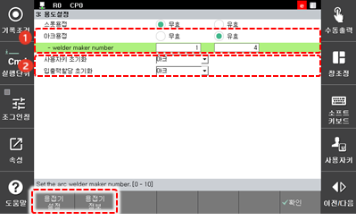

# 7.6.3.2 Arc Welding

작업 용도를 아크용접으로 선택하면 아크 용접 관련 명령어를 사용할 수 있으며 아크 용접 관련 메뉴에 접근할 수 있습니다.

1.	\[아크용접\] 사용을 유효로 설정하십시오. 화면 하단에 시스템에서 지원하는 용접기 정보와 설정 탭이 활성화 됩니다. [용접기 정보] 탭을 확인한 후 용접기 번호를 설정하십시오.

2.	\[사용자키 초기화\] 드롭다운 메뉴와 \[입출력할당 초기화\] 드롭다운 메뉴를 클릭하여 아크로 설정하십시오.

3. 자세한 설정은 아크용접 기능설명서의 [4.1 Arc 용접기 설정](https://hrbook-hrc.web.app/#/view/doc-arc-weld/korean/4_Setting/1_Arc_setting/README) 을 참고하시기 바랍니다.

