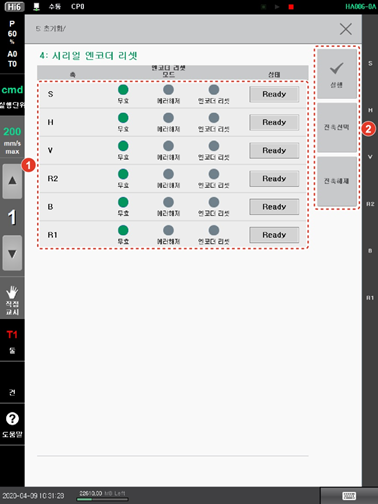

# 7.6.4 시리얼 엔코더 리셋

시리얼 엔코더는 내부 메모리에 엔코더 회전수 정보를 저장합니다. 모터의 에러 상태를 해제하거나 엔코더의 영점을 리셋하여 엔코더의 회전수를 0으로 클리어할 수 있습니다.

1. \[5: 초기화 &gt; 4: 시리얼 엔코더 리셋\] 메뉴를 터치하십시오.
2. 각 축의 엔코더 리셋 모드를 설정하고 상태를 확인한 후 리셋을 실행하십시오.

<table>
  <thead>
    <tr>
      <th style="text-align:left">번호</th>
      <th style="text-align:left">설명</th>
    </tr>
  </thead>
  <tbody>
    <tr>
      <td style="text-align:left">
        
      </td>
      <td style="text-align:left">
        
축별로 엔코더 리셋 사용
          여부와 모드를 설정합니다.

        <ul>
          <li>[무효]: 시리얼 엔코더
            리셋을 실행하지 않습니다.</li>
          <li>[에러해제]: 엔코더 회전수를
            클리어하지 않고 모터의
            엔코더 관련 에러만 해제합니다.</li>
          <li>[엔코더 리셋]: 모터의
            엔코더 관련 에러를 해제하고
            엔코더의 영점을 리셋하여
            회전수를 클리어합니다.</li>
        </ul>
      </td>
    </tr>
    <tr>
      <td style="text-align:left">
        
      </td>
      <td style="text-align:left">
        <ul>
          <li>[실행]: 시리얼 엔코더
            리셋을 실행합니다.</li>
          <li>[전축선택]: 모든 축을
            한 번에 선택합니다.</li>
          <li>[전축해제]: 모든 축의
            선택을 한 번에 해제합니다.</li>
        </ul>
      </td>
    </tr>
  </tbody>
</table>


* 로봇 시스템의 초기화 설정 수행 시에 엔코더 리셋을 수행하고 로봇이 정상 동작 중에는 절대 엔코더 리셋을 수행해서는 안 됩니다. 다만, 통신 이상 등의 엔코더 관련 에러가 발생하거나 엔코더 배터리가 소실된 경우에는 엔코더 리셋을 수행할 수 있습니다. 이때에는 기존의 로봇 원점 위치와 달라지지 않도록 로봇 프로그램의 실제 위치를 확인하여 작업하십시오.
* 제어기와 엔코더에 전원이 공급되지 않으면 엔코더의 위치 정보가 손실되어 로봇 작업 프로그램 사용에 문제가 발생할 수 있습니다. 이를 해결하기 위해 시리얼 엔코더에 전용 배터리를 부착하여 제어기의 전원 상태에 관계없이 위치 정보를 기록합니다. 엔코더 배터리에 전압 에러가 발생하면 반드시 제어기의 전원이 켜져 있는 상태에서 배터리를 교체하여 위치 정보의 손실을 예방하십시오.


