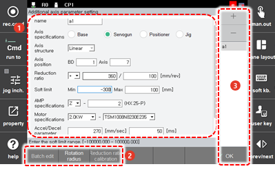

# 7.6.5 Additional Axis Parameter Setting

Additional axes that can be used in addition to the robot itself include the robot’s base axis \(travel axis\), servo gun axis, positioner axis, and jig axis. For details on the specification of each additional axis, refer to the “Additional Axis Function Manual.”

The method to set parameters such as the specification and configuration of the additional axes that are being used is as follows.

1.	Touch the \[5: Initialize &gt; 5: Additional Axis Parameter Setting\] menu.

2.	Set the parameters such as the specification and configuration of the additional axes.

<table>
  <thead>
    <tr>
      <th style="text-align:left">No.</th>
      <th style="text-align:left">Description</th>
    </tr>
  </thead>
  <tbody>
    <tr>
      <td style="text-align:left">
        
      </td>
      <td style="text-align:left">
        
Detailed parameter setting information of the additional axis. You can
          check and set the name, specification, and configuration, etc. of the additional
          axis.

        <ul>
          <li>[Name]: Name of the additional axis in use</li>
          <li>[Axis Specification]: Specification of the additional axis. You can use
            individual functions separately developed for each usage of the additional
            axis according to the specifications.</li>
          <li>[Axis structure]: Mechanism type of the additional axis. In the case of
            the specifications of some axes, you can designate the mechanism type that
            was registered in advance. As an exemplary case, you can select the standard
            positioner model in case of the position.</li>
          <li>[Axis position]: This is the position where the axis is connected to the
            DSP board. You can designate the BD number, DSP number, axis number, and
            brake number sequentially according to the wiring specifications.</li>
          <li>[Reduction ratio]: Information of the deceleration ratio that involves
            the motor and link of the additional axis
            <ul>
              <li>The deceleration ratio sign can be set according to the rotation direction
                of the motor shaft when the additional axis link moves in the (+) direction.
                When viewed from the front, if the shaft is rotating counterclockwise,
                the sign will be (+), and if it is rotating clockwise, the sign will be
                (-).</li>
              <li>The parameter of the numerator of the deceleration ratio is the moving
                distance (mm or deg) of the link, and the parameter corresponding to the
                denominator is the motor rotation speed corresponding to the moving distance
                of the link. The parameters of the setting items will be defined in integer
                form. For parameters that will be displayed with decimals, set the deceleration
                ratio as an integer by multiplying the numerator and denominator by a certain
                multiple.</li>
            </ul>
          </li>
          <li>[Soft limit]: The minimum and maximum operating range of the additional
            axis</li>
          <li>[AMP Specification]: The amplifier specification of the additional axis</li>
          <li>[Motor Specification]: Model name of the motor connected to the additional
            axis</li>
          <li>[Accel/Decel Parameter]: The maximum speed and acceleration time of the
            additional axis</li>
        </ul>
      </td>
    </tr>
    <tr>
      <td style="text-align:left">
        
      </td>
      <td style="text-align:left">
        <ul>
          <li>[Batch edit]: You can edit the BD and Axis numbers of multi addtional axes at one page.</li>
          <li>[Rotation radius]: You can add a new additional axis or delete an additional axis.</li>
          <li>[Reduction ratio calibration]: You can calibrate the difference between the real axis position and the displayed.</li>
        </ul>
      </td>
    </tr>
    <tr>
      <td style="text-align:left">
        
      </td>
      <td style="text-align:left">
        <ul>
          <li>[OK]: You can save the changes.</li>
          <li>[+]/[-]: You can add a new additional axis or delete an additional axis.</li>
        </ul>
      </td>
    </tr>
  </tbody>
</table>

