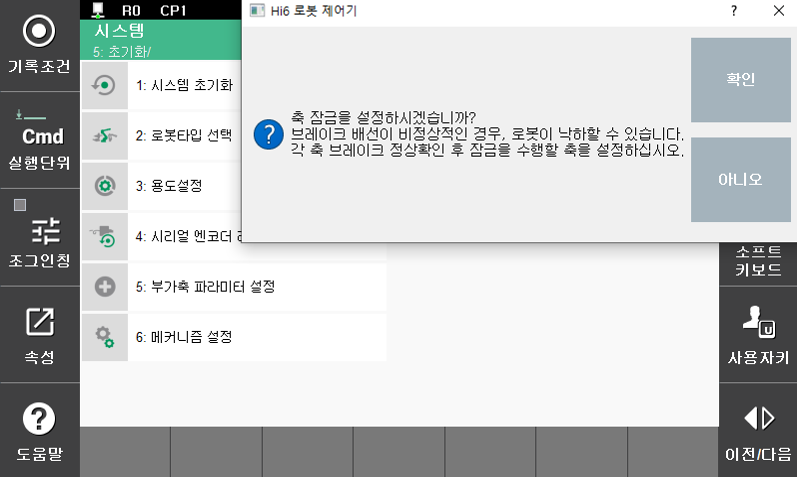

# 7.6.8.1  기능 설정 방법

### 메뉴 진입

『설정』 → 『5: 초기화』 → 『9: 축 잠금 설정』으로 메뉴를 선택합니다. 메뉴 선택시 아래와 같이 각 축 브레이크의 정상확인 여부를 물어봅니다. 


축잠금 기능은 브레이크 배선이 비정상적일 경우 로봇이 낙하할 수 있기때문에, 기능 설정전 각 축의 브레이크 배선이 정상적인지 반드시 확인하십시오. 


###  기능 설정

브레이크 배선의 정상여부 확인 후, 메뉴에 진입하면 아래와 같이 각 축의 사양과 축잠금 기능 설정 유무가 표시됩니다. 축잠금을 적용하려는 축의 선택한 후『확인』을 눌러 메뉴를 종료하십시오. 

