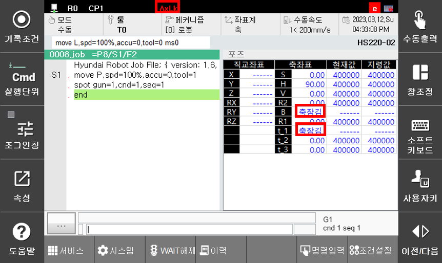
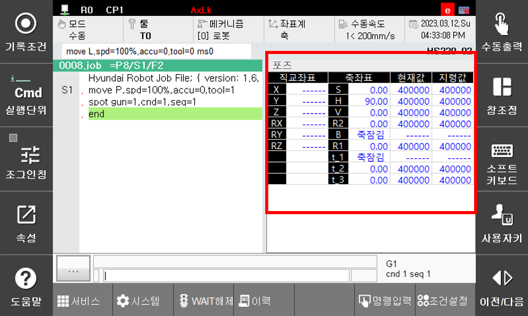
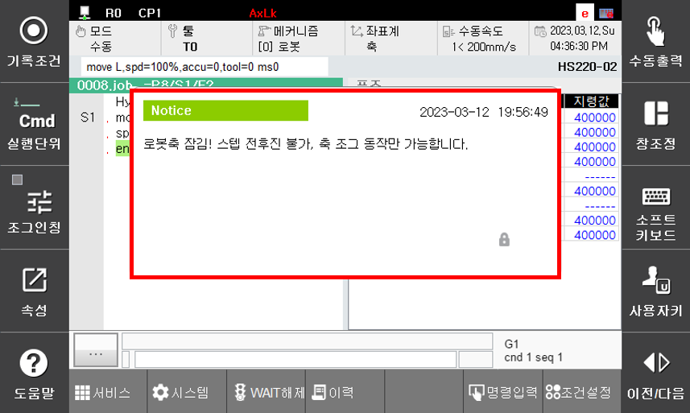

# 7.6.8.2 기능 적용여부 확인

축잠금 기능이 적용하면 잠긴축으로 인해 기존의 움직임과 다를 수 있으므로 축잠금여부를 항상 확인 후 로봇조작을 수행해야 한다. 기능의 적용여부는 상태표시줄과 경고메세지, 모니터링 표시상태로 확인할 수 있습니다.

### 상태표시창

상태표시창은 로봇 운전을 위한 각종 상태를 표시합니다. 


축잠금 기능을 사용하는 동안 해당 표시를 반드시 확인한 후 로봇을 조작하도록 하십시오.  


-	상태표시줄: AxLk
-	우측 매트릭스: “축잠김” 메시지 

### 모니터링 창(각축 데이터)

모니터링 중 각축 데이터는 기능이 적용된 축에 대하여 축잠김 메시지를 출력합니다. 로봇축과 베이스축이 잠긴 경우 좌표값을 표시할 수 없으므로, 직교좌표와 잠긴 축의 값은 ‘------‘로 표시합니다.

### 경고 메시지

화면 전환, 모드 전환시 잠긴 축에 해당하는 기능의 범위가 경고메세지로 출력됩니다. 해당 메세지를 통해 축잠김 기능의 적용여부와 기능의 범위를 항시 인지할 수 있습니다. 

