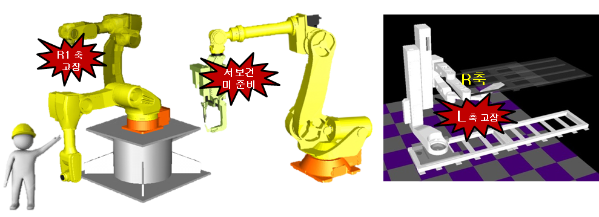

# 7.6.8 축 잠금

### 기능의 목적
로봇 및 부가축의 모터와 감속기 등의 문제로 축의 수리/교체가 필요할 때, 해당축을 임시로 무효화하여 타 정상축의 움직임을 허용하는 것이 축잠금 기능의 목적입니다. 정상축의 동작을 허용함으로써 로봇 유지보수의 편의성, 로봇 가용성 향상과 일부 로봇에 한하여 라인 생산성 손실을 최소화 하고자 합니다. 

 

### 기능의 범위

축잠금 기능을 적용하는 로봇과 축의 종류에따라 제공하는 기능의 범위는 다음 표와 같습니다.

|로봇|축잠금|모터ON|JOG(축)|JOG(직교)|스텝기록|명령어 기록|명령어 실행|스텝전후진|자동운전|
|:---:|:---:|:---:|:---:|:---:|:---:|:---:|:---:|:---:|:---:|
|모든로봇|로봇축|○|○|x|x|○|x|x|x|
|모든로봇|부가축|○|○|○|○|○|x|○|x|
|*예외로봇|특정축|○|○|○|○|○|○|○|○|
- *예외 로봇의 특정축: 
    -	HH140G-0A의 S축
    -	LCD 로봇의 L, R축
    -	LCD 2자유도 암 로봇의 LA,RA축

 


-	기능은 엔지니어코드(R314) 입력시에만 사용이 가능합니다.
-	기능 적용 시 잠긴축으로 인해 동작 

