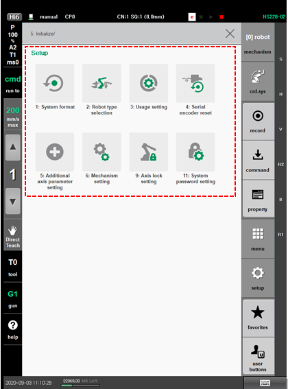

# 7.6 Initialize

If the robot controller does not operate normally, initialize the system. The system initialization must be performed by an engineer who has experience in initial setting of the robots of Hyundai Robotics.

1.	Touch the \[5: Initialize\] menu. Then, the menu for initialization will appear.

2.	Select the desired menu, and then perform the initial setting of the robot system, and then initialize the serial encoder.


Some items in the \[Initialize\] menu will be supported only when a specific type of an additional axis is selected.



* To initialize the system, you should contact the customer support team and ask for an expert or a qualified engineer to prevent false operation.
* 
  When the system is initialized, all data and programs saved in the controller will be deleted. Before initializing the system, you should back up your data and programs and restore them if necessary.

  For details on Data Backup and Restoration, refer to ???[4.2.5 Data Backup](../../4-menu/2-file-manager/5-data-backup.md)??? and ???[4.2.6 Data Restoration](../../4-menu/2-file-manager/6-data-restore.md)???.


