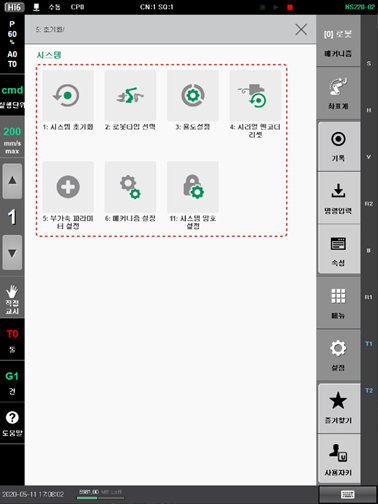

# 7.6 초기화

로봇 제어기가 정상적으로 동작하지 않는 경우 시스템을 초기화합니다. 반드시 현대로보틱스 로봇의 초기화 설정 경험이 있는 엔지니어가 시스템 초기화를 수행해야 합니다.

1.	\[5: 초기화\] 메뉴를 터치하십시오. 초기화 메뉴가 나타납니다.

2.	원하는 메뉴를 선택하여 로봇 시스템 및 시리얼 엔코더의 초기화를 수행하십시오.


\[초기화\] 메뉴의 일부 항목은 특정 유형의 부가축을 선택한 경우에만 지원됩니다.



* 시스템을 초기화하려면 고객지원팀에 문의하여 전문가에게 의뢰하거나 자격을 갖춘 엔지니어에게 문의하여 오조작을 예방하십시오.
* 시스템을 초기화하면 제어기에 저장된 모든 데이터와 프로그램이 삭제됩니다. 시스템을 초기화하기 전에 데이터와 프로그램을 백업해 두고 필요한 경우 복원하여 사용하십시오. 데이터 백업과 복원에 대한 자세한 내용은 “[4.2.5 데이터 백업](../../menu/file-manager/data-backup.md)”과 “[4.2.6 데이터 복원](../../menu/file-manager/data-restore.md)”을 참조하십시오.


