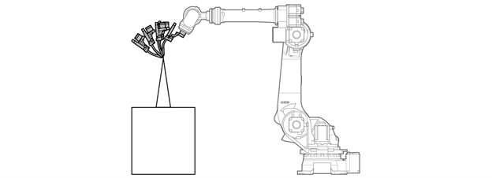
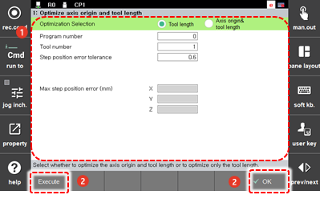

# 7.7.1 Optimize Axis Origin and Tool Length

The optimization of axis origin and tool length is a function to calibrate the origin and tool length of each axis of the robot without using an external measuring sensor.

Prepare two pointed tips. Fix one on the outside and the other on the tool. Then, while changing only the posture of the tooltip of the robot based on the outside fixed tip, you need to record several points using the robot program. At this time, you need to teach seven points to find the axis origin and tool length, and four points or more to find only the tool length.

Using the axis origin and tool length optimization function, you can find the optimized tool lengths X, Y, and Z and the optimized origin of the robot H, V, R2, and B axes as well, even when no CAD data is available for them.


When the axis origin and tool length optimization function is used, the encoder offset and tool length will be changed, thus also changing the operation position of the previously taught program. Therefore, you should perform the optimization of axis origin and tool length before writing the teaching program.



* In using the axis origin and tool length optimization function, the accuracy of the teaching is proportional to the accuracy of the maximum step position error result. Therefore, you should prepare two pointed tips and perform the teaching for the tooltip to match the two tips as accurately as possible. Make sure that the accuracy of the matching between the tooltip and the fixed points in space is within 0.5 mm when visually checked.
* Teach by setting a posture, with a difference of 30 deg or more, for each step so that the postures of the steps are not similar.
* Operate the wrist axes \(R2, B, R1\) as large as possible in a step and perform teaching while keeping a sufficient \(as large as possible\) angle difference of the wrist axes for individual steps.


The method to use the axis origin and tool length optimization function is as follows.

1.	Touch the \[6: Auto Calibration &gt; 1: Optimize Axis Origin and Tool Length\] menu.

2.	Select an optimization target and set detailed options.

<table>
  <thead>
    <tr>
      <th style="text-align:left">No.</th>
      <th style="text-align:left">Description</th>
    </tr>
  </thead>
  <tbody>
    <tr>
      <td style="text-align:left">
        
      </td>
      <td style="text-align:left">
        
Detailed parameter setting information of the additional axis. You can
          check and set the name, specification, and configuration of the additional
          axis.

        <ul>
          <li>[Optimization Selection]: You can select an optimization target.
            <ul>
              <li>[Tool Length]: You can calibrate the robot&#x2019;s tool length value.
                If the robot origin is correctly set, you can calibrate only the tool length.</li>
              <li>[Axis Origin &amp; Tool Length]: You can calibrate both the robot&#x2019;s
                origin and tool length values.
                 Normally, this function can be used when installing a robot and then initially
                setting the correct origin.</li>
            </ul>
          </li>
          <li>[Program Number]: You can set the number of the program in which the same
            point is recorded in multiple postures.</li>
          <li>[Tool Number]: This is the number of the tool to be set automatically.
            This should match the tool number recorded in the setting program.</li>
          <li>[Step location Error tolerance]: You can set the error range of the automatic
            calibration result (the initial setting value is 0.6 mm). If the expected
            error is within the error range, the integer data will be automatically
            updated, and if the error is out of the error range, whether to reflect
            the integer will be notified to and confirmed with the user, and then the
            necessary handling will be performed.</li>
        </ul>
      </td>
    </tr>
    <tr>
      <td style="text-align:left">
        
      </td>
      <td style="text-align:left">
        <ul>
          <li>[OK]: You can save the changes.</li>
          <li>[Execute]: You can execute optimization based on the set information.
            The optimization result will appear in [Max Step Position Error].</li>
        </ul>
      </td>
    </tr>
  </tbody>
</table>


It requires your attention that if you calibrate both the robot origin and tool length values, all origins of the robot will change, consequently changing the position of the previously created program.



* You can also set the origin of each axis and tool length of the robot in the settings menu.
  * Tool Length: \[Set Up &gt; 3: Robot Parameter &gt; 1: Tool Data\]
  * Origin of each axis: \[Set Up &gt; 3: Robot Parameter &gt; 2: Axis Origin\]
* If you calibrate the tool angle using the angle calibration function \(\[Set Up &gt; 3: Robot Parameter &gt; 1: Tool Data\]\), you should execute the origin axis and tool length optimization function first, and then execute the angle calibration. In this way, the tool data can be set correctly.


