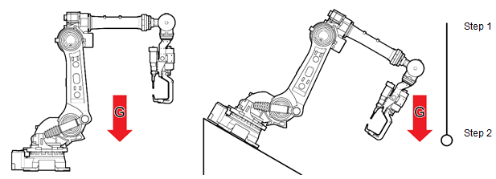
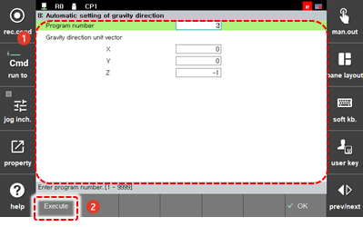

# 7.7.5 Gravity Direction Auto Setting

The Hi6 controller is based on dynamics, so it is important to set the gravity direction.

In general, the robot installation direction is perpendicular to the gravity direction as follows. If the robot is installed obliquely to the ground, the gravity direction should be set in the robot controller. At this time, you can use the automatic gravity direction setting function.

How to set the gravity direction is as follows.

1.	Attach a weight to the outside to indicate the gravity direction, and then teach two points \(Step 1, Step 2\) in the direction of the gravitational action.

2.	Touch the \[6: Auto Calibration &gt; 8: Automatic setting of gravity direction\] menu.

3.	After inputting the program number, touch the \[Execute\] button. Then, the direction vector will be calculated and displayed.

    

4.	After checking the direction vector value, touch the \[OK\] button. Then, the direction will be set as the gravity direction.

