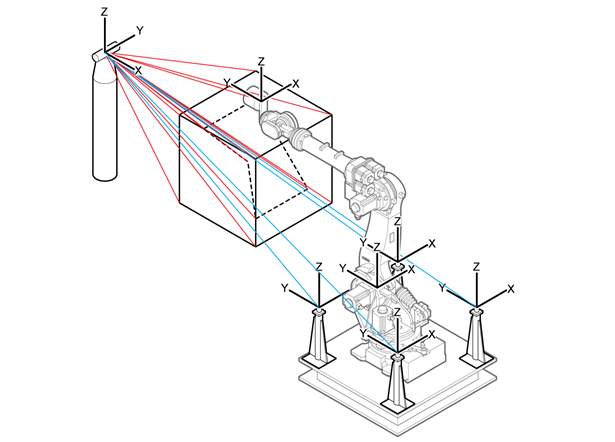
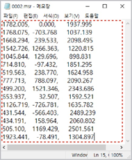
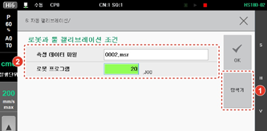
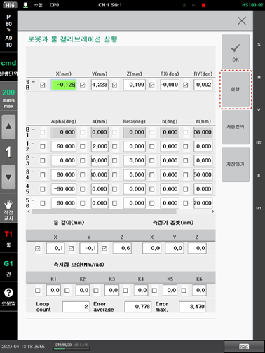
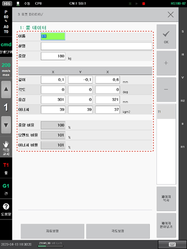

# 7.7.6 로봇과 툴 캘리브레이션

로봇과 툴 캘리브레이션 기능은 3차원 측정기로 로봇의 위치를 측정할 수 있는 환경에서 사용합니다.

1.	로봇의 툴 끝에 측정할 위치를 선정한 후 로봇의 위치와 자세를 다양하게 움직이면서 15 점 이상의 위치를 측정하고 로봇 위치를 프로그램으로 기록하십시오.

2.	측정한 로봇의 위치 데이터\(측정점 데이터\)를 X, Y, Z 형식으로 정리하여 파일\(형식: ASCII, 확장자: MSR\)을 생성하십시오.

3.	위치 데이터 파일을 이동식 저장 장치에 저장한 후 이동식 저장 장치를 티치 펜던트에 연결하십시오. Hi6 티치 펜던트 화면의 상태 표시줄에 \[USB\] 아이콘\(\)이 나타납니다.

4.	\[6: 자동 캘리브레이션 &gt; 9: 로봇과 툴 캘리브레이션\] 메뉴를 터치하십시오.

5.	\[탐색기\] 버튼을 터치하여 위치 데이터 파일을 선택한 후 측정에 사용한 로봇 프로그램을 설정하십시오.

6.	\[OK\] 버튼를 터치하십시오. 로봇과 툴 캘리브레이션 실행 화면으로 전환됩니다.

7.	로봇과 툴 캘리브레이션 실행 화면에서 \[실행\] 버튼을 터치하십시오. 캘리브레이션 결과가 나타납니다.

8.	캘리브레이션 결과를 확인한 후 \[OK\] 버튼을 터치하십시오. 캘리브레이션 결과값이 축 원점과 툴 정수에 자동으로 적용됩니다.

9.	\[3: 로봇 파라미터 &gt; 1: 툴 데이터\] 메뉴를 터치하여 로봇 캘리브레이션 실행 결과를 확인할 수 있습니다.


캘리브레이션 파라미터의 2 ~ 5축\(H, V, R2, B축\)의 축 원점과 툴 길이 X, Y, Z 값은 기본으로 선택되어 있습니다. 툴만 캘리브레이션하려면 각 축의 값을 선택 해제한 후 실행하십시오.


