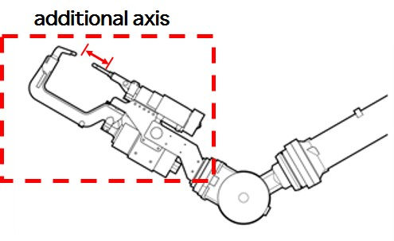
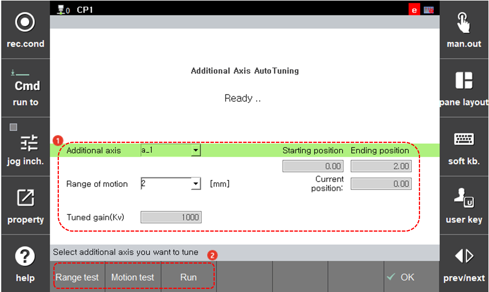
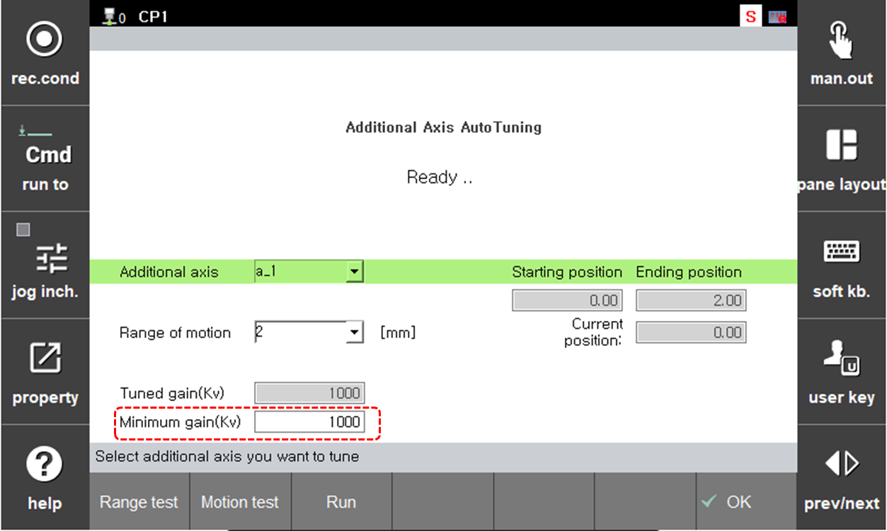

# 7.7.7 Additional Axis Autotuning

***Available from version V60.28-00.**

This function is used when additional axis does not have an appropriate gain set, resulting in noise or poor control performance. It finds the optimal gain by moving an additional axis within the user-defined range.

 

 **Setting**

**1.** **[Additional axis]**: select the additional axis to be tuned.

**2.** **[Range of motion]**: Set the range of motion for the additional axis (linear axis: 2, 5, 10[mm] / circular axis: 2, 5, 10[deg]). Adjust the additional axis using the jog to set an appropriate motion range
 * Starting position: the starting position when additional axis autotuning begins.
 * Ending position: the ending position when additional axis autotuning begins.
 * Current position: current position of additional axis.

**3.** Tuned gain(Kv): tuning parameter for additional axis.

 

 **Tuning Process (Range Test > Motion Test > Run)**

**1. Range Test**
* A "Testing" message appears, and the additional axis moves with low speed. If there is an issue with the motion range, press the STOP button and set the motion range again.

**2. Motion Test**
* A "Testing" message appears, and the additional axis moves with high speed to check the initial tuning gain.

**3. Run**

* A "Running" message appears, and additional axis autotuning executes.
* During tuning, there may be noise from the additional axis (due to finding the vibration gain value)
* When tunning is finished, TP shows the before and after tuning parameter Kv. Clicking [OK] will show a message asking whether to apply the tuned gain. If [OK] is clicked, the tuned gain will be set.

 

**Supervisor Mode**

* In supervisor Mode, the minimum tuning gain Kv can be changed.

