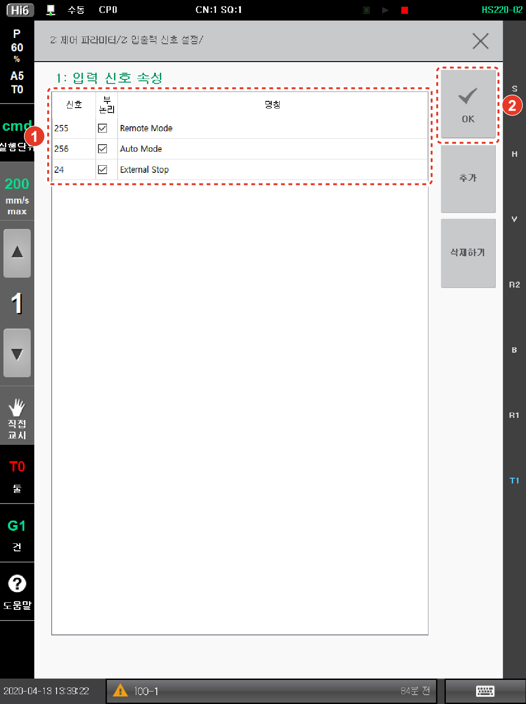

# 7.3.2.1 입력 신호 속성

범용 입력 신호에 대한 신호의 논리와 명칭을 설정합니다.

1.	\[2: 제어 파라미터 &gt; 2: 입출력 신호 설정 &gt; 1: 입력 신호 속성\] 메뉴를 터치하십시오.

2.	범용 입력 신호 목록을 확인하고 설정한 후 \[OK\] 버튼을 터치하십시오.

* \[추가\]: 목록에 새로운 범용 입력 신호를 추가합니다.
* \[삭제하기\]: 목록에서 범용 입력 신호를 삭제합니다.

