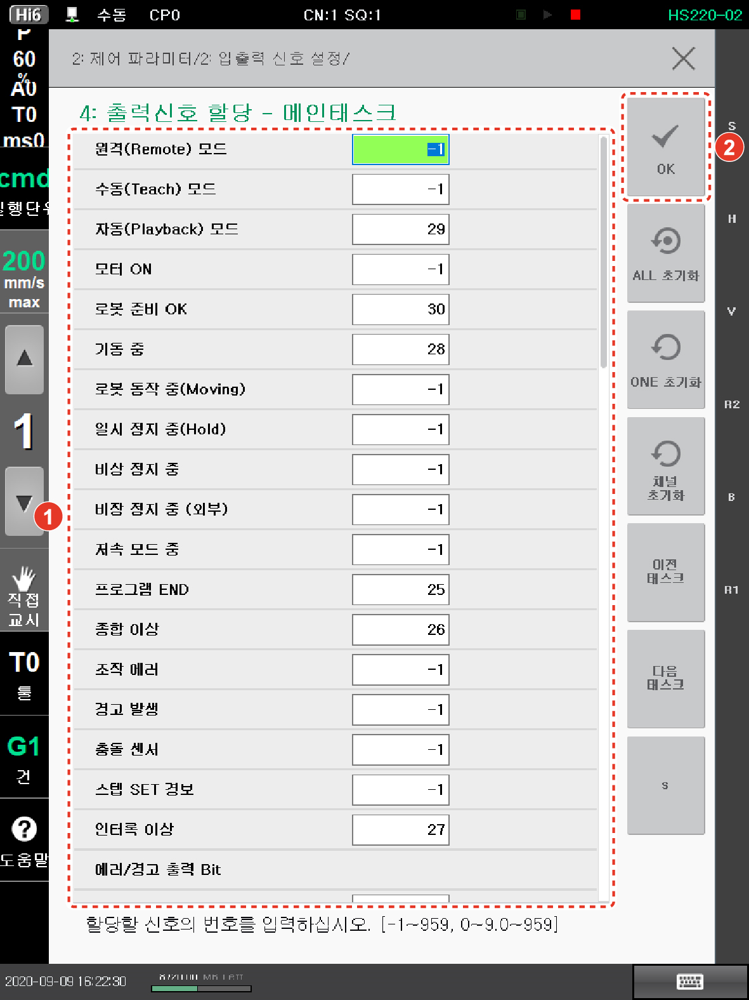

# 7.3.2.6 출력 신호 할당

제어기 출력 신호를 이용해 제어기에 발생한 이벤트 정보나 상태 정보를 외부로 전달할 수 있습니다. 외부로 전달할 정보에 출력 신호를 할당하는 방법은 다음과 같습니다.

1.	\[2: 제어 파라미터 &gt; 2: 입출력 신호 설정 &gt; 4: 출력신호 할당\] 메뉴를 터치하십시오.

2.	정보 항목에 출력 신호 번호를 입력한 후 \[OK\] 버튼을 터치하십시오.

* \[ALL 초기화\]: 모든 정보 항목에 할당된 출력 신호의 번호를 초기화합니다.
* \[ONE 초기화\]: 선택된 정보 항목에 할당된 출력 신호의 번호를 초기화합니다.
* \[채널 초기화\]: 설정한 출력 신호의 입력 채널을 초기화합니다. 채널은 fb0 ~ fb9로 구성되며, fb0인 경우 fb0가 생략되어 표시됩니다.
* \[이전 태스크\]/\[다음 태스크\]: 이전 또는 다음 태스크 화면으로 이동합니다.
* \[S\]: 원격 제어를 시스템 입력 신호로 사용할 경우, 시스템 신호를 지정합니다. 시스템 신호는 알파벳 s에 신호 번호를 조합하여 “s+숫자”로 구성됩니다. 예를 들어, 시스템 신호 49는 s49로 설정합니다.

