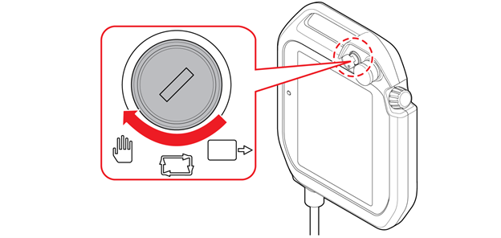
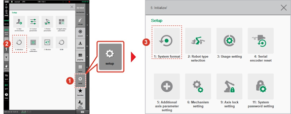
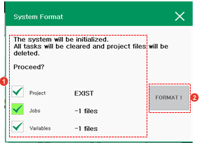

# 7.6.1 System Format

1.	On the status bar of the Hi6 teach pendant screen, check if the operation mode is set to manual mode.

* If it is set to automatic mode, turn the mode switch of the teach pendant to set it to manual mode.

2.	Touch the \[Set Up\] button &gt; \[5: Initialize &gt; 1: System format\] menu.

3.	After checking the saved data, touch the \[Initialize\] button. All data and programs including control parameter files and machine parameter files will be deleted, and the initial setting values will be restored.

