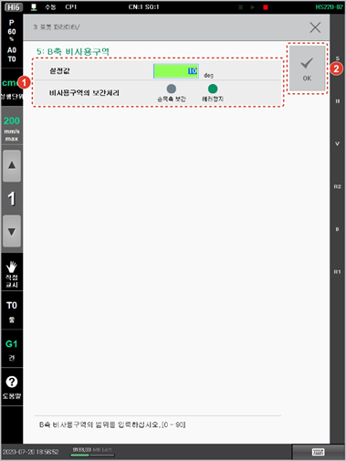

# 7.4.5 B축 비사용구역

B축의 0도 부근에서는 R1축 회전 중심축과 R2축의 회전 중심축이 거의 평행이 되는데, 로봇의 TCP가 직선이나 원호와 같은 보간 동작을 하면 작은 움직임에도 손목 축이 급격히 동작하게 됩니다.

B축의 비사용 구역을 설정합니다.

1.	\[3: 로봇 파라미터 &gt; 5: B축 비사용구역\] 메뉴를 터치하십시오.

2.	비사용 구역의 판단 각도와 보간 처리 방식을 설정한 후 \[OK\] 버튼을 터치하십시오.

* \[설정값\]: B축 비사용 구역의 판단 각도를 입력합니다.
* \[비사용구역의 보간처리\]: 로봇의 궤적이 보간 동작으로 B축 비사용 구역을 통과해야 하는 경우, 에러 처리 및 로봇의 정지 여부를 설정합니다.

