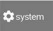
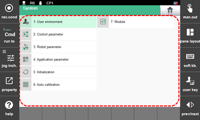

# 7.1 在“system”中的菜单使用

1. 在手动或自动模式下，触摸功能按钮栏上的 `[system]` 按钮。然后，程序的设置菜单将显示。

    

2. 通过选择所需菜单，您可以检查和设置用户信息及各种参数信息。

    

* `[1: User Environment]`：您可以检查和设置各种用户条件。
* 
  `[2: Control Parameter]`：您可以设置控制器和输入/输出信号、通信信息、机器人准备好信号条件、原点信号和坐标系统的各种条件。

* 
  `[3: Robot Parameter]`：您可以设置与机器人操作相关的各种数据，如每个轴的原点和操作范围。

* `[4: Application Parameter]`：您可以检查和设置用于机器人应用功能的各种参数。
* 
  `[5: Initialize]`：您可以执行机器人系统的初始设置。您还可以初始化串行编码器。

* 
  `[6: Auto Calibration]`：您可以使用教导机器人正确使用的程序以及将自动操作的运动来校准机器人的轴原点、工具长度、负载质量和基轴方向等。