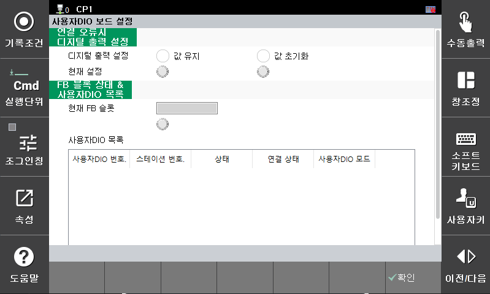



# 7.10.1 UserDIO Board Setting


This function is supported from the Hi7 controller.


In the Hi7 controller, the User DIO Board (BD681) and Extension DIO Board (BD682) can be used to process digital input/output signals and the conveyor interface.


For detailed information on the User DIO Board settings, refer to the  "[Hi7 Robot Controller Function Manual - User DIO, Extension DIO](https://hrbook-hrc.web.app/#/view/doc-userDIO-ExtensionDIO/en/README)".
