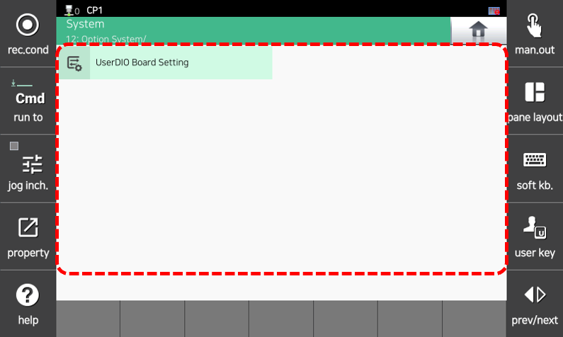



# 7.10 Option System


This function is supported from the Hi7 controller.


1.	Touch `[Option System]`. The Option System menu appears.

2.	Select the desired menu to perform the corresponding function.

