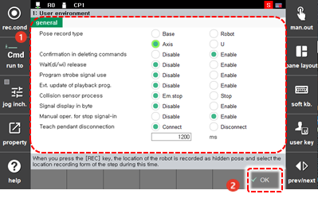
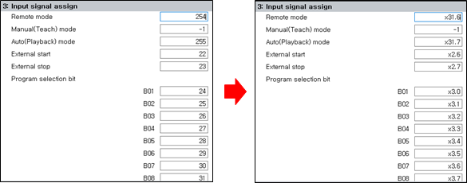

# 7.2 User Environment

You can check and set various user conditions. 

1.	Touch the \[1: User environment\] menu. Then, the user environment setting window will appear.

2.	After setting the user environment, touch the \[OK\] button.

* \[1: Pose record type\]: You can set the type of the position recording of the step to be recorded as a hidden pose. ("[2.3.1.2 Pose](../2-operation/3-step/1-step-cmd-param/2-pose.md)")
  * \[Base\]/\[Robot\]/\[Axis Angle\]: You can record the position of the step based on the base coordinate, robot, and axis angle values.

  * \[U\]: You can record the position in the user coordinate system.
* \[2: Confirmation in deleting commands\] You can set whether to expose the deletion confirmation window when deleting a statement in manual mode.

* \[3: Wait\(di/wi\) release\]: While in the input signal wait or welding complete signal wait status, you can set whether to force the signal wait status to be deactivated by pressing <**SHIFT**> + [rel.WAIT].
* \[4: Program strobe signal use\]: When selecting an external program by receiving an external digital signal, you can set the time when the external program is to be selected.

  * \[Disable\]: Makes it possible to select an external program by reading only the external program selection signal

  * \[Enable\]: Makes it possible to select an external program by reading the external program selection signal at the time when the program strobe sognal is inputted

* \[5: Ext. update of playback prog.\]: You can set whether to allow the process of externally \(PC\) modifying the program that is being played back, and then to allow the process of downloading it to the controller \(With regard to the number of the program being played back, the downloaded program will be applied from the next cycle\).


If the program being played back is modified externally \(PC\) and downloaded to the controller, it could cause a failure of or abnormality with the product. Contact our customer support team to ask an expert or an engineer.


* \[6: Collision sensor process\]: You can set a method of stopping the robot when the collision sensor is operating.
  * \[\(1\) Em.stop\]: The robot will stop into the emergency stop mode, where the robot falls down motor-off status.

  * \[\(2\) Stop\]: The robot will stop into the normal stop mode, where the robot remains in motor-on status.

* \[7: Signal display in byte\]: You can display signal addresses in byte unit by selecting [Enable].
  * 'Input signal assign' page changes as below accorinding to your selection.
  
    

* \[8:Manual oper. for stop signal in\]: You can set whether to enable jog operation when an external stop signal is inputted.

* \[9: Teach pendent seperation\]: You can disconnect the teach pendant from the controller to operate the robot in auto mode.

  * If set as <Disconnect>, there will be no “E0015 Teaching pendant operation abnormal” error, which would otherwise occur when the communication between the teach pendant and the controller is severed. 

  * When it is set as <Disconnect> and the teach pendant is disconnected from the controller, and power is supplied, the controller will recognize the current mode as remote mode, allowing the robot to be auto-operated through external Motor On and external start-up. 

  * Because the emergency switch and mode conversion switch are separately connected through a signal wire to the teach pendant, you must appropriately wire this signal wire. 

  * Connect CNRTP connector pin #9 (Auto) to #2 (M1) and pin #5 (Emergency stop 1) to #2 (M1), and use the exclusive CNRTP connector with pin #6 (Emergency stop 2) connected to #1 (P1) instead of the teach pendant.


  Editing the period of connection checking is avaiable in engineer mode.
