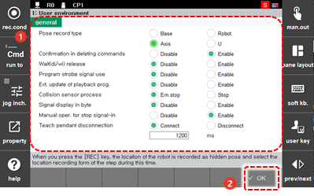
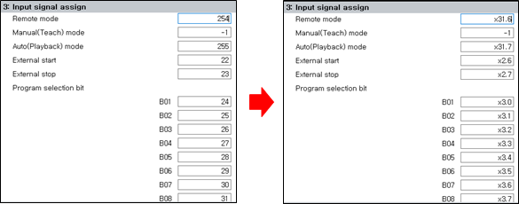

# 7.2 用户环境

您可以检查和设置各种用户条件。

1. 触摸 `[1: 用户环境]` 菜单。然后，用户环境设置窗口将出现。

2. 设置用户环境后，触摸 `[确定]` 按钮。

    

* `1: 姿势记录类型 (1: Pose record type)`: 您可以设置记录为隐藏姿势的步骤的位置记录类型。 ("[2.3.1.2 Pose](../2-operation/3-step/1-step-cmd-param/2-pose.md)")
  * `[基准]`/`[机器人]`/`[轴角]`: 您可以根据基准坐标、机器人和轴角值记录步骤的位置。

  * `[用户]`: 您可以在用户坐标系中记录该位置。
* `2: 删除指令确认 (2: Confirmation in deleting commands)` 您可以设置在手动模式下删除语句时是否显示删除确认窗口。

* `3: 强制释放“等待”指令`: 设置在等待“等待”指令时是否使用 `[SHIFT]` + [rel.WAIT] 键强制释放等待状态。
* `4: 程序选通信号启用 (4: Program strobe signal use)`: 在通过接收外部数字信号选择外部程序时，您可以设置选择外部程序的时间。

  * `[禁用]`: 只通过读取外部程序选择信号选择外部程序

  * `[启用]`: 在输入程序选通信号时，允许通过读取外部程序选择信号选择外部程序

* `5: 再现程序的外部更新 (5: Ext. update of playback prog.)`: 您可以设置是否允许外部 \(PC\) 修改正在回放的程序，并允许将其下载到控制器 \(关于正在回放的程序编号，下载的程序将从下一个循环开始应用\)。


如果正在回放的程序被外部 \(PC\) 修改并下载到控制器中，可能会导致产品故障或异常。请联系我们的客户支持团队咨询专家或工程师。


* `[6: 碰撞传感器处理]`: 您可以设置当碰撞传感器运行时停止机器人的方法。
  * `[(1) 紧急停止]`: 机器人将进入紧急停止模式，机器人处于掉落的电机关闭状态。

  * `[(2) 停止]`: 机器人将进入正常停止模式，机器人保持在电机开启状态。

* `[7: 字节中的信号显示]`: 您可以通过选择 `[启用]` 在字节单位中显示信号地址。
  * '输入信号分配' 页面根据您的选择发生如下变化。

    

* `8: 停止信号的手动操作`: 您可以设置在输入外部停止信号时是否启用手动操作。

* `[9: 教学挂件断开]`: 您可以从控制器断开教学挂件，以在自动模式下操作机器人。

  * 如果设置为 `分离 (Disconnect)`，当教学挂件与主板之间的通信断开时，不会发生 "E2800 教学挂件操作异常" 错误。(当通信断开时，机器人仍然可以操作。)

  * 在 `连接 (Connect)` 状态下，您可以设置超时期限以确定通信是否丢失。

  * 当设置为 `分离 (Disconnect)` 并且教学挂件与控制器断开时，供电后，控制器将识别当前模式为远程模式，允许机器人通过外部电机开启和外部启动进行自动操作。

  * 如果您将其设置为 `连接 (Connect)`，教学挂件与主板之间的通信故障将触发 "E2800 教学挂件通信错误"，导致电机关闭。(在输入工程师代码 (R314) 后，您可以配置通信超时时间。)

  * 由于紧急开关和模式转换开关通过信号线分别连接到教学挂件，因此您必须适当地布线此信号线。

  * 将 CNRTP 连接器引脚 #9 (Auto) 连接到 #2 (M1)，将引脚 #5 (紧急停止 1) 连接到 #2 (M1)，并使用专用的 CNRTP 连接器，将引脚 #6 (紧急停止 2) 连接到 #1 (P1)，而不是教学挂件。