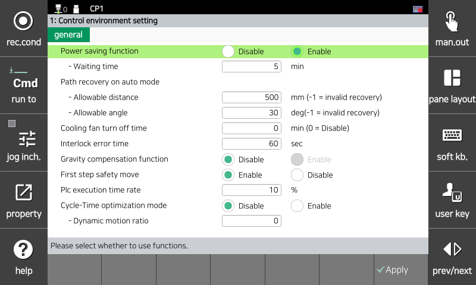

# 7.3.1 Control Environment Setting

You can set various conditions of the controller and perform necessary operations.

1.	Touch the \[2: Control Parameter &gt; 1: Control Environment Setting\] menu.

2.	After setting each control environment condition, touch the \[OK\] button.

       

* \[Power saving function\]: You can set whether to use the power saving function and set the wait time.

  While the power saving function is used, if the robot is in operation stop status while in the auto mode for a long period, such as waiting for startup or waiting for an input signal, the power supply to the motor will be cut off when the wait time has expired, helping save power consumption. When an operation command is inputted in the robot, the power saving function will be automatically deactivated, allowing the power to be supplied to the motor and the robot to operate.


Delays may occur in the process of activating/deactivating the power-saving function. When operating while expecting the speed of the robot, you should set the power saving function as disable.


* \[Path recovery on auto Mode\]: You can set the allowable distance and allowable angle for path recovery in automatic mode.

  During path recovery, an error will be detected if the distance and angle exceed the set allowable range. If the allowable distance is set to 1, no path recovery will take place.

* \[Cooling fan turn off time \]: When the robot is in operation, the temperature inside the controller rises due to regenerative resistance, and the cooling fan must be operated to prevent this temperature rise.

  When the robot is not in operation, the temperature inside the controller no longer rises, so there is no reason for the cooling fan to operate at this time. Rather, when the cooling fan operates, there are only adverse effects such as shortened fan life, noise generation, and increased power consumption.

  When the robot is in an operating state (motor on), the cooling fan must operate immediately. When the robot is in an inoperable state (motor ff, power saving operation), the cooling fan does not operate after a certain period of time has elapsed. If the cooling fan does not operate immediately, the temperature inside the controller rises due to the latent heat of the regenerative resistance.

  The signal output for controlling the cooling fan on/off operation is set in the "Cooling fan control" item in the [System/Control parameter/Input/Output signal setting/Output signal assign] menu, and the circuit for controlling the cooling fan power is created with this output signal. It must be configured.

  If "Cooling fan off operation time" is set to 0 or the "Cooling fan control" output signal is set to -1, the cooling fan always operates.

* \[Interlock error time\]: This function sets the maximum waiting time for the input    signal.  
  If the input signal standby time exceeds the specified time during playback, an interlock error signal is output. This specified time is the interlock abnormality time.

  The interlock error signal is a signal assigned to “Interlock abnormal warning” in the [System/Control Parameter/Input/Output signal setting/Output signal assign] menu.

* \[First step safety move\]: When starting the robot, set whether to limit the first step to a safe speed and move at the currently set speed.
  * Enable : Move to the safe limit speed.
  * Disable : Move to the currently set speed.

  For safety reasons, it is basic for robots to move at a safe speed when starting the first step. Special work such as sealing or painting may cause quality problems, so use it only in these cases.

* \[Plc execution time rate\]: When using a embedded PLC, you can adjust the PLC execution time inside the controller. The controller internally executes the PLC ladder program every 5ms, so set how much PLC execution is allocated. The larger this ratio leads the shorter the scan time of the PLC program. But if it is too large, the CPU execution time may be insufficient and a task execution time exceeded error may occur.

* \[Cycle Time Optimization Mode\]: This feature reduces the robot’s step movement time during automatic playback to improve productivity.
  - Enabled
    - Dynamically adjusts acceleration/deceleration curves and maximum speed for faster movement.
    - Dynamic motion adjustment applied

  - Disabled
    - Uses predefined acceleration, deceleration, and maximum speed settings.
    - Operates in standard motion profile mode

  - Dynamic Motion Ratio (`0 ~ 100`)
    - `0`: Disabled (static motion)
    - `1 ~ 100`: Adjusts the intensity of dynamic motion
    - Higher values apply more aggressive optimization for speed and acceleration


For processes where cycle time is critical (e.g., repetitive pick-and-place), applying a high dynamic motion ratio can help improve throughput.



Be aware that higher values may lead to mechanical vibration or trigger over-torque faults, especially under high payload or rapid directional changes.
