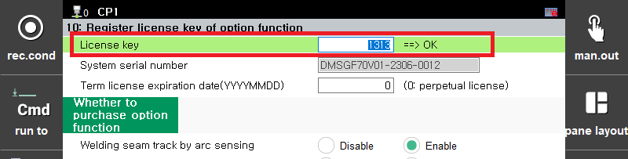

# 7.3.10.3 Register license key

* Registration screen

  

* If the license key has been entered correctly, "==> OK" will be displayed to the right of the license key input.

* If "==> NG" is displayed, the license key is incorrect or the purchase option has been selected incorrectly.

