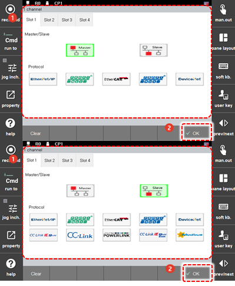

# 7.3.11.1 PCI插槽设置

您可以设置用于工业通信的PCI插槽。

1.	触摸`[2: Control Parameter - 11: 工业通信 - 1: 1：PCI插槽设置 - 1 Channel] ([2: Control Parameter  - 11: Industrial Communication  - 1: PCI Slot Settings  - 1 Channel])`菜单。然后，PCI插槽设置屏幕将出现。

2.	选择所需的选项卡，然后设置通信方式\(主/从\)和协议。之后，点击`[OK]`按钮。

    


当PCI插槽设置完成后，插槽#1 - #4中设置的CONFIG文件将全部删除。当您在使用中想更改通信PCI插槽时，应单独备份现有的CONFIG设置，并在恢复后使用。 


3.	关闭控制器的电源，然后再重新打开。


* 当您执行PCI插槽的设置以使用它时，设置值将在您关闭控制器的电源并重新打开后才会应用于系统。
