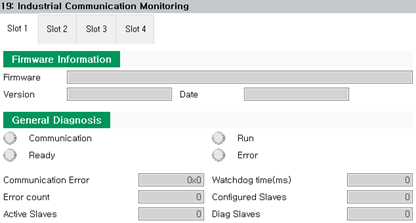

# 7.3.11.3 监控

您可以监控您在工业通信菜单中设置的固件和通信的设置信息和操作状态。

1. 触摸 `服务 - 19: 工业通信监控 (service - 19: Industrial Communication Monitoring)` 菜单。然后将出现每个板的工业通信监控屏幕。

2. 通过选择所需的选项卡，您可以检查固件、通信设备和通信配置的详细信息。

    

 


您可以使用 `[Restart]` 按钮重新启动 PCI 通信卡的工业通信。
