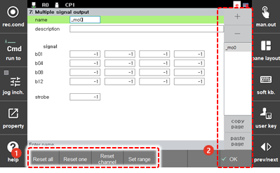
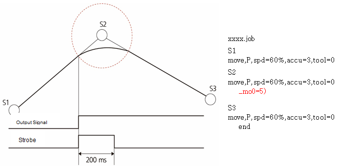

# 7.3.2.10 Multiple Signal Output

Output signals \(up to 16 signals\) can be created as a group, and data can be outputted through individual signals.

The data is in binary format and determines whether the output will be on or off. For example, the data to print do41 and do43 on the screen shown below is 0101 in binary \(5 in decimal\).

1.	Touch the \[2: Control Parameter &gt; 2: Input/Output Signal Setting &gt;7: Multiple Signal Output\] menu

2.	Set the name, signals, and strobe of the output signal group. 

    

<table>
  <thead>
    <tr>
      <th style="text-align:left">No.</th>
      <th style="text-align:left">Description</th>
    </tr>
  </thead>
  <tbody>
    <tr>
      <td style="text-align:left">
        
      </td>
      <td style="text-align:left">
        
Detailed information on the group selected from the output signal group
          list. You can set the name, description, signal and strobe of the group.

        <ul>
          <li><b>[Reset All]/[Reset One]:</b> You can reset the set value of all signals
            or of a selected signal to -1.</li>
          <li><b>[Reset Channel]:</b> You can reset the output channel of the set signal
            (0&#x2013;9: digital signals)</li>
          <li><b>[Set Range]</b>: You can quickly set the signal by designating the
            start and end signals.</li>
        </ul>
      </td>
    </tr>
    <tr>
      <td style="text-align:left">
        
      </td>
      <td style="text-align:left">
        <ul>
          <li><b>[OK]:</b> You can save the edited content.</li>
          <li><b>[+]/[-]:</b> You can add a new output signal group or delete an output
            signal group.</li>
          <li>This shows a list of output signal groups. Selecting a group name allows
            you to view and edit details.</li>
          <li><b>[Copy Page/Paste Page]:</b> You can copy the output signal group information
            and paste it to another group.</li>
          <li>Select the name of the group to be copied from the list, touch the <b>[Copy Page]</b> button,
            select the name of the group to which the value is to be applied, and touch
            the <b>[Paste Page]</b> button.</li>
        </ul>
      </td>
    </tr>
  </tbody>
</table>

For example, when a job program configured as the setting in the screen above is executed, the operation will be as follows.

When the robot starts from S1 toward S2 and the accuracy of S2 is OK, the strobe signal will be outputted together with the signal of the designated group. The strobe signal will be turned off after 200 ms. \(The strobe signal is a pulse signal of 200 ms.\)

