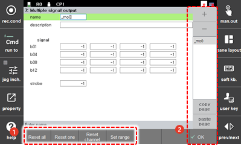
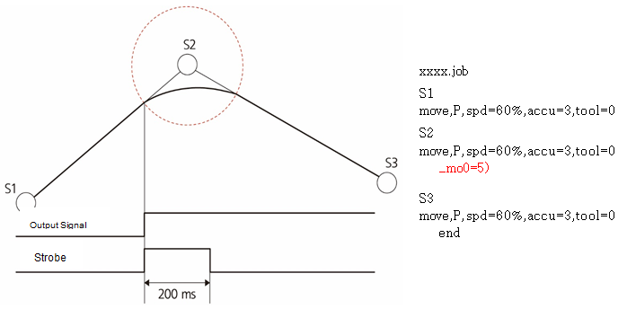

# 7.3.2.10 多信号输出

输出信号 \(最多 16 个信号\) 可以作为一个组创建，数据可以通过单独的信号输出。

数据以二进制格式表示，并决定输出是开启还是关闭。例如，在下面所示的屏幕上打印 do41 和 do43 的数据是 0101（在十进制中为 5）。

1.	触摸 `2: 控制参数 - 2: 输入/输出信号设置 - 7: 多信号输出 (2: 控制参数 - 2: 输入/输出信号设置 - 7: 多信号输出)` 菜单

2.	设置输出信号组的名称、信号和脉冲。

    

<table>
  <thead>
    <tr>
      <th style="text-align:left">编号</th>
      <th style="text-align:left">描述</th>
    </tr>
  </thead>
  <tbody>
    <tr>
      <td style="text-align:left">
        
      </td>
      <td style="text-align:left">
        
关于从输出信号组列表中选择的组的详细信息。您可以设置组的名称、描述、信号和脉冲。

        <ul>
          <li><b>[重置全部]/[重置一个]:</b> 您可以将所有信号的设定值或选定信号的设定值重置为 -1。</li>
          <li><b>[重置通道]:</b> 您可以重置设定信号的输出通道（0&#x2013;9: 数字信号）</li>
          <li><b>[设定范围]</b>: 您可以通过指定起始信号和结束信号快速设定信号。</li>
        </ul>
      </td>
    </tr>
    <tr>
      <td style="text-align:left">
        
      </td>
      <td style="text-align:left">
        <ul>
          <li><b>[确定]:</b> 您可以保存编辑的内容。</li>
          <li><b>[+]/[-]:</b> 您可以添加一个新的输出信号组或删除一个输出信号组。</li>
          <li>这显示了输出信号组的列表。选择一个组名允许您查看和编辑详细信息。</li>
          <li><b>[复制页面/粘贴页面]:</b> 您可以复制输出信号组信息并粘贴到另一个组。</li>
          <li>从列表中选择要复制的组名称，触摸 <b>[复制页面]</b> 按钮，选择要应用值的组名称，然后触摸 <b>[粘贴页面]</b> 按钮。</li>
        </ul>
      </td>
    </tr>
  </tbody>
</table>

例如，当按照上面屏幕中的设置配置的作业程序执行时，操作将如下。

当机器人从 S1 向 S2 移动，并且 S2 的精度为 OK 时，脉冲信号将与指定组的信号一起输出。脉冲信号将在 200 毫秒后关闭。（脉冲信号是 200 毫秒的脉冲信号。）