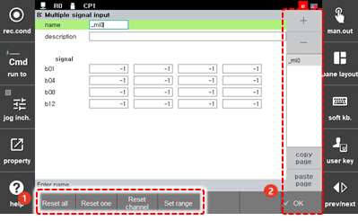
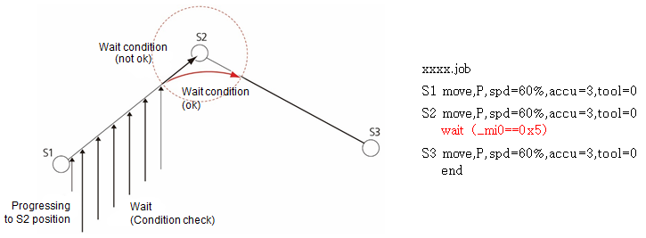

# 7.3.2.11 多信号输入

输入信号（最多16个信号）可以作为一个组创建，可以通过单个信号获取数据。

数据采用二进制格式，通过输入的开或关来确定。例如，如果di41和di43为开，所有其他信号为关，则数据将为0101（十进制中的5）。

1. 触摸 `2: 控制参数 - 2: 输入/输出信号设置 - 8: 多信号输入 (2: 控制参数 - 2: 输入/输出信号设置 - 8: 多信号输入)` 菜单。

2. 设置输入信号组的名称、信号和波特率。

    

<table>
  <thead>
    <tr>
      <th style="text-align:left">编号</th>
      <th style="text-align:left">描述</th>
    </tr>
  </thead>
  <tbody>
    <tr>
      <td style="text-align:left">
        
      </td>
      <td style="text-align:left">
        
有关从输入信号组列表中选择的组的详细信息。您可以设置组的名称、描述和信号。

        <ul>
          <li><b>[重置所有]</b>/<b>[重置一个]</b>: 您可以将所有信号或选定信号的设置值重置为-1。</li>
          <li><b>[重置通道]</b>: 您可以重置设置信号的输入通道（0–9：数字信号）</li>
          <li><b>[设置范围]</b>: 您可以通过指定开始和结束信号快速设置信号。</li>
        </ul>
      </td>
    </tr>
    <tr>
      <td style="text-align:left">
        
      </td>
      <td style="text-align:left">
        <ul>
          <li>[确定]: 您可以保存编辑的内容。</li>
          <li>[+]/[-]:您可以添加一个新的输入信号组或删除一个输入信号组。</li>
          <li>这显示输入信号组的列表。选择一个组名称可以检查和编辑详细信息。</li>
          <li><b>[复制页面]</b>/<b>[粘贴页面]: </b>您可以复制输入信号组信息并将其粘贴到另一个组中。
             从列表中选择要复制的组名称，触摸<b>[复制页面]</b>按钮，选择要应用值的组名称，然后触摸<b>[粘贴页面]</b>按钮。</li>
        </ul>
      </td>
    </tr>
  </tbody>
</table>

例如，当按照上面屏幕中的设置配置的作业程序执行时，操作将如下所示。

从S1开始到S2，机器人执行等待语句。如果在S2的准确性尚可之前满足等待条件，机器人将移动到红色路径。如果不是这样，机器人将等待直到满足等待条件。