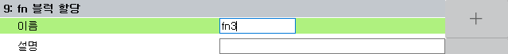
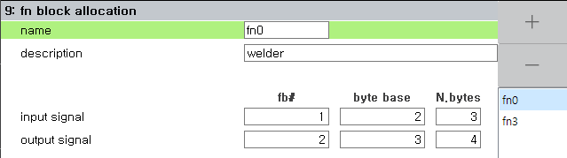
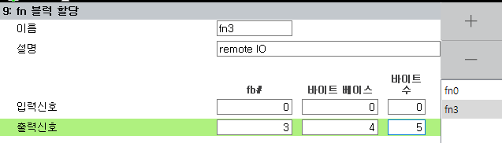

# 7.3.2.12 fn block allocation

You can define fn objects by specifying specific areas of fb objects.
If the Hi6 controller is a fieldbus master, and there are multiple fieldbus slave devices, you can set the areas of each slave device to each fn object to handle these slaves intuitively.

The set fn objects can be used in the same way as the fb objects in the robot language and the embedded PLC.

1. Select the menu `[2: Control Parameter - 2: Input/Output signal settings - 9: Fn block allocation]`.

2. If it's still before the fn setup, the screen is empty. Click the + button on the right to add a new fn object. The fn index number automatically increases from 0 to 63.

3. To change the fn index number, type the new name and click the `[F7: OK]` or `SHIFT+[F7:Apply]` button.
  

4. For each fn object, set the area of the input signal and the output signal separately.

5. In the `fb#` column, set the index number (0-9) of fb object on which place the fn area.

6. In the `byte base` column, specify the byte index to start the fn region within the fb object.

7. In the `N.bytes` column, specify the size of the fn region in bytes.

&nbsp;  

For example, if set as shown in the figure below;

&nbsp;  

It is mapped as shown in the table below.

<table>
  <thead>
    <tr>
      <th></th>
      <th>fn0</th>
      <th>fb</th>
    </tr>
  </thead>
  <tbody>
    <tr>
      <td>Input</td>
      <td>
        fn0.dib[0~2] 
        fn0.xb[0~2]
      </td>
      <td>
        fb1.dib[2~4] 
        fb1.xb[2~4]
      </td>
    </tr>
    <tr>
      <td>Output</td>
      <td>
        fn0.dob[0~3] 
        fn0.yb[0~3]
      </td>
      <td>
        fb2.dob[3~6] 
        fb2.yb[3~6]
      </td>
    </tr>
  </tbody>
</table>

<table>
  <thead>
    <tr>
      <th></th>
      <th>fn3</th>
      <th>fb</th>
    </tr>
  </thead>
  <tbody>
    <tr>
      <td>Input</td>
      <td>
        -
      </td>
      <td>
        -
      </td>
    </tr>
    <tr>
      <td>Output</td>
      <td>
        fn3.dob[0~4] 
        fn3.yb[0~4]
      </td>
      <td>
        fb3.dob[4~8] 
        fb3.yb[4~8]
      </td>
    </tr>
  </tbody>
</table>

You can open the fn input / output monitoring panel to view or manually output the current value of the dio or xy relay for each fn object. See the link below for more information.

[6.8 fn input, fn output](../../../6-monitoring/8-fn-io.md)
