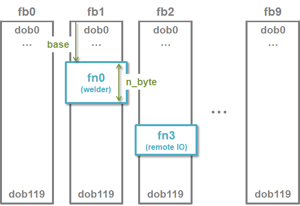
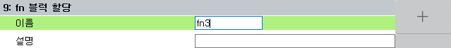
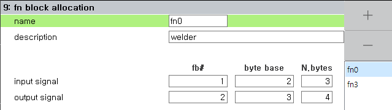
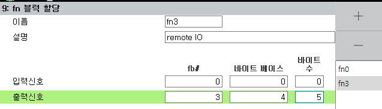

# 7.3.2.12 fn 块分配

您可以通过指定 fb 对象的特定区域来定义 fn 对象。如果 ${cont_model} 控制器是字段总线主设备，并且有多个字段总线从设备，您可以将每个从设备的区域设置为每个 fn 对象，以直观地处理这些从设备。

设置的 fn 对象可以在机器人语言和嵌入式 PLC 中与 fb 对象以相同的方式使用。

1. 选择菜单 `[2: 控制参数 - 2: 输入/输出信号设置 - 9: Fn 块分配]`。

2. 如果还未进行 fn 设置，屏幕是空的。单击右侧的 + 按钮添加新的 fn 对象。fn 索引号自动从 0 增加到 63。

3. 要更改 fn 索引号，输入新名称，然后单击 `[F7: 确定] ([F7: OK])` 或 `SHIFT+[F7:Apply]` 按钮。
  

4. 对于每个 fn 对象，分别设置输入信号和输出信号的区域。

5. 在 ` (fb#)` 列中，设置 fb 对象的索引号 (0-9)，以放置 fn 区域。

6. 在 `起始字节 (byte base)` 列中，指定在 fb 对象内开始 fn 区域的字节索引。

7. 在 `字节数 (N.bytes)` 列中，指定 fn 区域的字节大小。

&nbsp;  

例如，如果像下图所示设置；

&nbsp;  

则映射如下表所示。

<table>
  <thead>
    <tr>
      <th></th>
      <th>fn0</th>
      <th>fb</th>
    </tr>
  </thead>
  <tbody>
    <tr>
      <td>输入</td>
      <td>
        fn0.dib[0~2] 
        fn0.xb[0~2]
      </td>
      <td>
        fb1.dib[2~4] 
        fb1.xb[2~4]
      </td>
    </tr>
    <tr>
      <td>输出</td>
      <td>
        fn0.dob[0~3] 
        fn0.yb[0~3]
      </td>
      <td>
        fb2.dob[3~6] 
        fb2.yb[3~6]
      </td>
    </tr>
  </tbody>
</table>

<table>
  <thead>
    <tr>
      <th></th>
      <th>fn3</th>
      <th>fb</th>
    </tr>
  </thead>
  <tbody>
    <tr>
      <td>输入</td>
      <td>
        -
      </td>
      <td>
        -
      </td>
    </tr>
    <tr>
      <td>输出</td>
      <td>
        fn3.dob[0~4] 
        fn3.yb[0~4]
      </td>
      <td>
        fb3.dob[4~8] 
        fb3.yb[4~8]
      </td>
    </tr>
  </tbody>
</table>

您可以打开 fn 输入/输出监控面板，以查看或手动输出每个 fn 对象的 dio 或 xy 继电器的当前值。有关更多信息，请参见以下链接。

[6.2.5 fn 输入，fn 输出](../../../6-monitoring/2-io/5-fn-io.md)