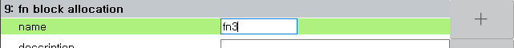
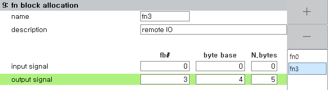

# 7.3.2.12 fn 블럭 할당

fb객체의 특정 영역을 지정하여 fn객체를 정의할 수 있습니다.
Hi6 제어기가 필드버스 master이고, 여러 개의 필드버스 slave장치들이 있을 경우, 각 slave장치의 영역들을 하나씩의 fn객체로 설정해두면, 이 slave들을 직관적으로 다룰 수 있습니다.

설정된 fn객체는 로봇언어와 내장PLC에서 fb객체와 동일한 방식으로 사용될 수 있습니다.

1. `[2: 제어 파라미터 - 2: 입출력 신호 설정 - 9: fn 블록 할당]` 메뉴를 선택하십시오.

2. 아직 fn 설정 전이라면 화면이 비어 있습니다. 우측의 + 버튼을 클릭하면 새로운 fn 객체가 추가됩니다. fn 인덱스 번호는 0에서 63까지 자동으로 증가합니다.

3. fn 인덱스 번호를 변경하려면, 새 이름을 타이핑한 후 `[F7:확인]` 혹은 `SHIFT+[F7:적용]` 버튼을 클릭하십시오.
  

4. 각 fn 객체에 대해 입력신호와 출력신호의 영역을 따로 설정합니다.

5. `fb#` 열에는 fn 영역을 어떤 fb객체 내에 배치할 지를 fb 인덱스 번호(0~9)로 설정합니다.

6. `바이트 베이스` 열에는 fb객체 내에서 fn 영역을 시작할 byte 인덱스를 지정합니다.

7. `바이트 수` 열에는 fn영역의 크기를 byte 단위로 지정합니다.

&nbsp;  

예를 들어서 아래 그림과 같이 설정된 경우;

&nbsp;  

아래 표와 같이 매핑됩니다.

<table>
  <thead>
    <tr>
      <th></th>
      <th>fn0</th>
      <th>fb</th>
    </tr>
  </thead>
  <tbody>
    <tr>
      <td>입력</td>
      <td>
        fn0.dib[0~2] 
        fn0.xb[0~2]
      </td>
      <td>
        fb1.dib[2~4] 
        fb1.xb[2~4]
      </td>
    </tr>
    <tr>
      <td>출력</td>
      <td>
        fn0.dob[0~3] 
        fn0.yb[0~3]
      </td>
      <td>
        fb2.dob[3~6] 
        fb2.yb[3~6]
      </td>
    </tr>
  </tbody>
</table>

<table>
  <thead>
    <tr>
      <th></th>
      <th>fn3</th>
      <th>fb</th>
    </tr>
  </thead>
  <tbody>
    <tr>
      <td>입력</td>
      <td>
        -
      </td>
      <td>
        -
      </td>
    </tr>
    <tr>
      <td>출력</td>
      <td>
        fn3.dob[0~4] 
        fn3.yb[0~4]
      </td>
      <td>
        fb3.dob[4~8] 
        fb3.yb[4~8]
      </td>
    </tr>
  </tbody>
</table>

fn 입력, fn 출력 모니터링 창을 열어, 각 fn객체의 dio 혹은 xy 릴레이 현재값을 확인하거나 수동출력할 수 있습니다. 자세한 내용은 아래 링크를 참고하십시오.

[6.8 fn 입력, fn 출력](../../../6-monitoring/2-io/5-fn-io.md)
