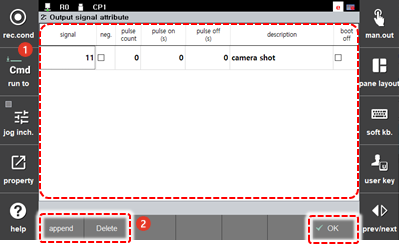

# 7.3.2.2 输出信号属性

您可以设置一般输入信号的逻辑、脉冲和名称。

1. 触摸 `2: 控制参数 - 2: 输入/输出信号设置 - 2: 输出信号属性 (2: 控制参数  - 2: 输入/输出信号设置  - 2: 输出信号属性)` 菜单。

2. 检查并设置一般输入信号列表，然后触摸 `[OK]` 按钮。

    

* `[Append]`: 您可以将新的一般输出信号添加到列表中。
* `[Delete]`: 您可以从列表中删除一般输出信号。