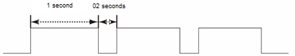
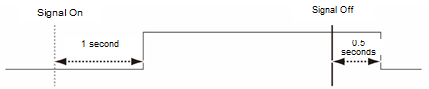

# 7.3.2.3 输入/输出信号设置信息

* `[Signal]`: 应用属性的信号。fb块信号可以通过顺序输入块编号、小数点和信号编号来指定。

  例如，如果您想指定块fb1的信号35，可以通过输入1.35来设置。

* 
  `[Negative Logic]`: 一般输入/输出信号的正逻辑和负逻辑如下所示。

* `[Pulse Count]`: 脉冲计数。这是脉冲的计数。如果设置为1到100之间的值，将发生脉冲输出；如果设置为0，将发生延迟输出。
* 
  `[Pulse On]`/`[Pulse Off]`: 这是脉冲输出或延迟输出发生时输出信号的开启状态时间和关闭状态时间。

  根据脉冲属性值的脉冲输出示例如下。

* 
  脉冲输出：计数：3。开启状态时间：1秒。关闭状态时间：0.2秒

* 延迟输出：计数：0。开启状态时间：1秒。关闭状态时间：0.5秒

* `[Name]`: 一般输入/输出信号的名称