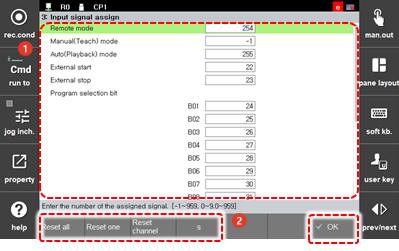

# 7.3.2.4 输入信号分配

您可以使用控制器输入信号远程控制控制器的状态或操作。分配远程控制项中的输入信号编号的方法如下。

1. 触摸 `2: 控制参数 - 2: 输入/输出信号设置 - 3: 输入信号分配 (2: 控制参数 - 2: 输入/输出信号设置 - 3: 输入信号分配)` 菜单。

2. 在远程控制项中输入输入信号编号后，触摸 `[OK]` 按钮。

    

* `[重置所有]`: 您可以重置分配给所有远程控制项的输入信号编号。
* 
  `[重置一个]`: 您可以重置分配给选定远程控制项的输入信号编号。

* 
  `[重置通道]`: 您可以初始化设定输入信号的输入通道。通道由 fb0 到 fb9 组成，在 fb0 的情况下，显示中将省略 fb0。

* 
  `[S]`: 您可以在使用远程控制作为系统输入信号时指定系统信号。系统信号由 "s+编号" 组成，将字母 s 与信号编号结合。例如，您可以将系统信号 49 设置为 s49。