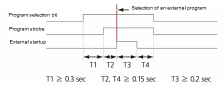
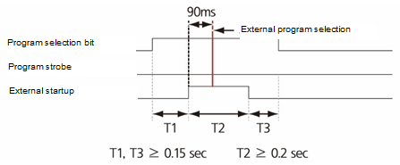
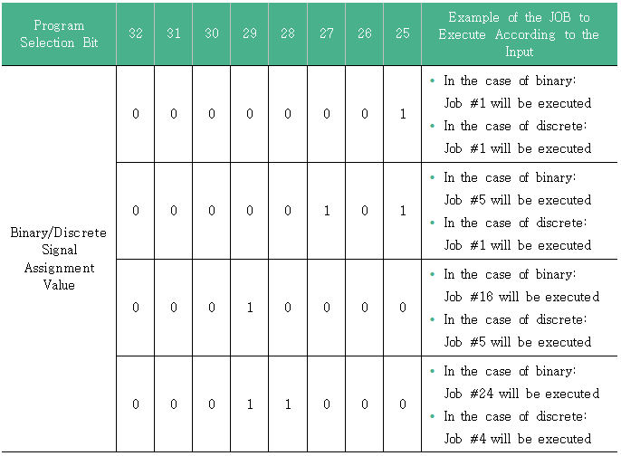

# 7.3.2.5 输入信号设置信息

#### 远程模式

当教学挂钩的模式开关选择为远程 \(\) 时，相应的信号应被开启，以便选择远程模式。如果相应的信号被关闭，将选择内部模式。一般来说，如果教学挂钩的模式开关选择为远程 \(\)，用户希望选择远程模式，这就是基本值设定为 254 的原因，相应的信号将在输入信号属性中指定为负逻辑。

#### 手动（教学）模式

在选择远程模式时，如果相应的信号被开启，您将处于可以手动操作机器人在远程模式下的状态。然而，通常情况下，在这种状态下操作机器人是没有的，并且此模式很少使用。

#### 自动（回放）模式

在选择远程模式时，如果相应的信号被开启，您将处于可以自动操作机器人在远程模式下的状态。然而，通常情况下，如果教学挂钩的模式开关选择为远程 \(\)，用户希望在远程模式下自动操作机器人，这就是基本值设定为 255 的原因，相应的信号将在信号属性中指定为负逻辑。

#### 外部启动

此功能用于在远程自动模式下启动机器人。

#### 外部停止

此功能用于在远程自动模式下停止机器人。

#### 外部程序选择

当机器人被外部启动时，读取程序选择位并确定为外部程序的时机取决于是否使用闪烁信号。

* 当程序闪烁信号使用设置为启用：如果在有外部启动输入的情况下程序闪烁信号处于开启状态，则将读取程序选择位，并且读取的值将被确定为程序编号。

* 当程序闪烁信号使用设置为禁用：在有外部启动输入后，将读取程序选择位，如果此值在 90 ms 内未发生变化，将确定为程序编号。

#### 程序选择位和二进制/离散（关 -> 二进制）

程序选择位是输入外部启动信号时选择要执行的程序的信号组合。仅在当前在 TP 的头部或结束指向步骤时应用。当程序正在执行时，将执行程序至结束。

二进制/离散信号是一个选项，用于确定程序选择位的解释，如果为 0，将被识别为二进制，如果为 1，将被识别为离散。

例如，如果程序选择位设置如下，则根据输入要执行的 JOB 示例如下。

#### 外部重置

此功能用于通过外部信号执行与从教学挂钩执行 R0 步骤计数器重置功能相同的操作。当机器人启动时，此功能将不会操作。如果此功能正常操作，执行位置将移动到程序的开头，并且各种错误或警告的发生状态将被清除。有关此功能的信息，请参考 "[8.2 R0 重置步骤计数器](../../../8-r-code/2-r0.md)"。

#### 

#### 限速指令

此功能用于通过外部信号将机器人移动速度限制在安全速度 \(250 mm/s\) 以内。

#### 碰撞传感器

此功能用于检测机器人的碰撞并停止机器人。结合在 `[System - 1: User Environment - 6: Collision Sensor]` 菜单中的设置，将确定停止机器人的条件和信号逻辑。

#### 错误/警告信号清除

此功能用于通过外部信号清除各种错误和警告的发生状态。

#### 

#### 操纵杆模式

此功能用于手动操控机器人。一般在 LCD 宏检验设备中使用。有关使用该功能的详细手册，请参阅单独的功能手册。

#### 门开关

此功能用于在安全围栏的门打开时停止机器人移动。

#### 屏幕保护程序禁用

如果教学挂钩没有操作，当在 `[service - 11: Teach Pendant Option] ([service  - 11: Teach Pendant Option])` 菜单中设置的屏幕关闭时间到期时，教学挂钩将切换到屏幕保护状态。此功能用于通过外部信号打开教学挂钩的屏幕。

#### 外部电机开启

此功能用于从外部操作面板开启电机。

#### 外部电机关闭

此功能用于从外部操作面板关闭电机。