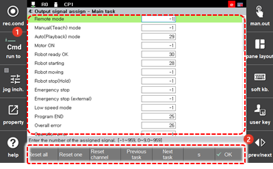

# 7.3.2.6 输出信号分配

在控制器中发生的事件信息或状态信息可以通过控制器输出信号传输到外部。将输出信号分配给要传输到外部的信息的方法如下。

1.	触摸 `2: 控制参数 - 2: 输入/输出信号设置 - 4: 输出信号分配-主任务 (2: 控制参数  - 2: 输入/输出信号设置  - 4: 输出信号分配-主任务)` 菜单。

2.	在信息项中输入输出信号编号后，触摸 `[OK]` 按钮。

    

* `[重置所有]`：您可以重置分配给所有信息项的输出信号编号。
*  `[重置一个]`：您可以重置分配给所选信息项的输出信号编号。
* 
  `[重置通道]`：您可以重置分配给信息项的输出信号输入通道 \(0-16: 数字信号\)

* 
  `[上一个任务]`/`[下一个任务]`：您可以移动到上一个或下一个任务屏幕。

* 
  `[S]`：在通过系统输入信号使用遥控时，您可以指定一个系统信号。系统信号的形式为 "s+数字"，将字母 s 与信号编号结合。例如，您可以将系统信号 49 设置为 s49。