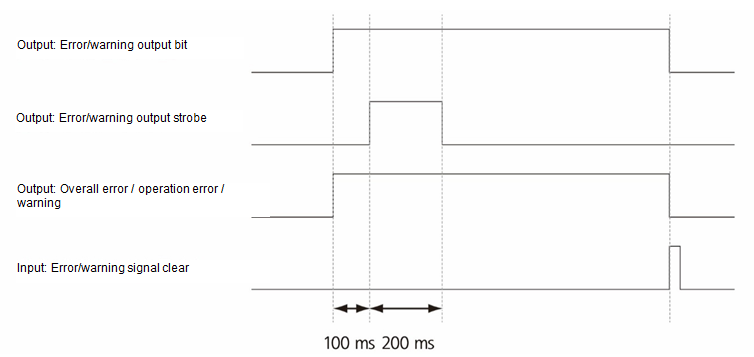

# 7.3.2.7 输出信号设置信息

#### 远程模式

当教学挂件的模式开关选择为远程 \(\) 时，应在信号输入分配部分设置输入信号为“打开”状态，以激活远程状态。此功能用于将状态输出到外部。

#### 手动 \(教学\) 模式

此功能用于将控制器的操作模式为手动的状态输出到外部。

#### 自动 \(回放\) 模式

此功能用于将控制器的操作模式为自动的状态输出到外部。

#### 电机开启

当通过输入电机开启信号为每个电机供电并准备好驱动时，此功能用于将状态输出到外部。

#### 机器人就绪 OK

当当前控制器状态满足在 `[system - 2: Control Parameter - 4: Robot Ready Condition] ([system  - 2: Control Parameter - 4: Robot Ready Condition])` 菜单中设定的所有条件时，此功能用于将状态输出到外部。

#### 机器人启动

当机器人通过手动模式的前进/后退操作启动或通过自动模式的启动信号输入启动时，此功能用于将此状态输出到外部。

#### 机器人移动

当机器人正在移动时，此功能用于将此状态输出到外部。

#### 机器人停止 \(保持\)

当机器人停止时，与启动信号的输出相反，此功能用于将此状态输出到外部。

#### 紧急停止

当来自教学挂件前面或控制器的紧急停止按钮的输入信号被输入时，此功能用于将状态输出到外部。

#### 紧急停止 \(外部\)

此功能用于将来自连接到系统板的外部紧急停止设备的信号输出到外部。

#### 低速模式

当在信号输入分配部分为低速命令设置的信号打开时，或当机器人在手动模式下以安全速度运行时，此功能用于将此状态输出到外部。

#### 程序结束

当在作业程序中执行结束循环时，此功能用于将此状态输出到外部。

#### 整体错误

控制器中发生的错误分为由系统错误引起的错误和由用户操作失误引起的错误。当因为系统错误而发生错误时，此功能用于将此状态输出到外部。由系统错误引起的错误范围为 1 到 999 和 2000 到 7999。

#### 操作错误

控制器中发生的错误分为由系统错误引起的错误和由用户操作失误引起的错误。当因为用户操作失误而发生错误时，此功能用于将此状态输出到外部。供参考，由系统错误引起的错误范围为 1 到 999 和 2000 到 7999。

#### 警告

当控制器中发生警告时，此功能用于将此状态输出到外部。

#### 碰撞传感器

当在信号输入分配部分设定的碰撞传感器信号输入打开，并确认机器人发生碰撞时，此功能用于将此状态输出到外部。

#### 步骤设定警告

在自动模式下，如果当前选择的光标位置与之前执行的位置不同，可能会有危险。此功能用于将此状态输出到外部。

#### 联锁异常警告

当作业程序的 wait 语句中的等待时间超过在 `[System - 2: Control Parameter - 1: Control Environment Setting]` 菜单中的 `[Interlock Abnormal Time]` 选项设定的时间时，此功能用于将此状态输出到外部。

错误/警告输出位，错误/警告输出选择和错误/警告输出闪烁

对于错误/警告输出位、错误/警告输出闪烁、整体异常、操作错误和警告发生信号，请参考以下顺序。

#### 外部复位确认

当在信号输入分配部分设定的外部复位信号打开时，此功能用于将此状态输出到外部。该信号将持续 200 毫秒，然后自动关闭。

#### 程序回显位

当通过在信号输入分配部分设定的程序选择位选择程序时，此功能用于将所选程序编号输出到外部。

#### 程序确认

当机器人通过在远程模式下输入外部启动信号启动时，此功能用于将状态输出到外部。该信号将持续 200 毫秒，然后自动关闭。

#### 弧焊异常

当发生与弧焊相关的错误时，此功能用于将此状态输出到外部。

#### 弧沉积警告

当在弧焊期间发生焊接沉积时，此功能用于将此状态输出到外部。该信号将持续 200 毫秒，然后自动关闭。

#### 机器人锁定状态 \(有效=开\)

此功能用于将 `[Condition Setting]` 中的机器人锁定设置状态输出到外部。

#### 现场总线异常，和现场总线空闲

当使用 CC-LINK 和 DeviceNet 等现场总线通信板时，此功能用于将通信状态输出到外部。

#### 电池 \(备份，编码器\) 电压下降

当备份电池的电压下降以维持安装在主板上的 SRAM 状态或编码器电池的电压下降以维持安装在每个电机上的编码器值时，此功能用于将此状态输出到外部。

#### 扭矩监测

此功能用于将施加在机器人六个轴上的扭矩值输出到外部。将输出到外部的扭矩值是1/2倍率的%值。

#### 润滑剂注入警报

此功能用于将需要注入润滑剂的状态输出到外部。

#### 平均负载因子异常警报

此功能用于将机器人在操作过程中是否超过平均负载因子的状态输出到外部。