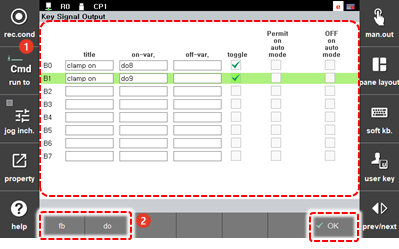

# 7.3.2.8 Key Signal Output

By assigning the output signal of the controller to the signal keys of the teach pendant, you can perform setting in a way to turn on or output signal.

1.	Touch the \[2: Control Parameter &gt; 2: Input/Output Signal Setting &gt; 5: Key Signal Output\] menu. 

2.	Set a label, a signal, a function name , and options of the button, and then touch the \[OK\] button.

    

* \[fb\]/\[do\]: You can easily input the signal output variable value by using numbers and decimal point only.

For example, input 2.9 and press the <<b>ENTER</b>> key. Then, it will be converted to and displayed as fb2.do9. If you input 9 without decimal point and press the <<b>ENTER</b>> key, it will be converted to do9.


You can register the desired output signal with a button in the user key area of Hi6 teach pendant. For details, refer to "[2.7.2.1 Key Signal Output Function Area](../../../2-operation/7-user-key/2-button-registration/1-key-signal-output.md)".


