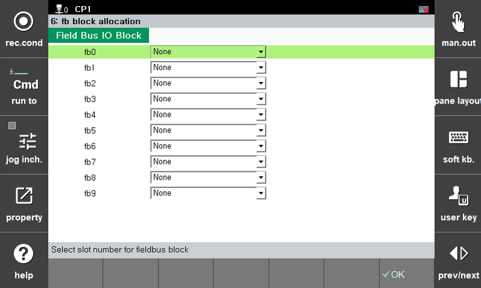

# 7.3.2.9 FB Block Allocation

You can set the method of using the controller's general input/output signals.

1.	Touch the `2: Control Parameter  - 2: Input/Output Signal Setting  - 6: FB Block Allocation` menu.

2.	Set the connection with the DIO block of the selected FB address, and then touch the `[OK]` button.

    


The available connection options are as follows:
* [PCI Slot 1]
* [PCI Slot 2]
* [PCI Slot 3]
* [EtherNet/IP Adapter]
* [EtherCAT I/O]
* [EtherNet/IP Scanner]
* [User DIO]


