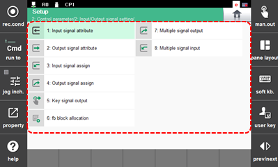

# 7.3.2 Input/Output Signal Setting

1.	Touch the \[2: Control Parameter &gt; 2: Input/Output Signal Setting\] menu. Then, the input/output signal setting menu will appear.

2.	Select the desired menu and set the input/output signal attributes and signal assignment, etc.

