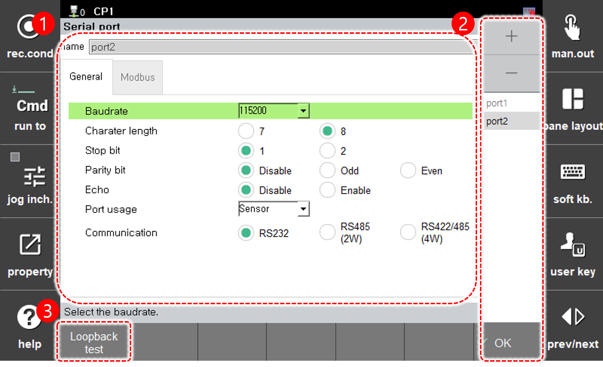

# 7.3.3 串口

您可以设置串口通信所需的信息。

1. 触摸`[2: 控制参数 - 3: 串口] ([2: 控制参数  - 3: 串口])`菜单。

2. 设置每个串口的参数。

    

<table>
  <thead>
    <tr>
      <th style="text-align:left">编号</th>
      <th style="text-align:left">描述</th>
    </tr>
  </thead>
  <tbody>
    <tr>
      <td style="text-align:left">
        
      </td>
      <td style="text-align:left">从串口列表中选择的端口的详细信息。您可以设置端口名称和参数值。</td>
    </tr>
    <tr>
      <td style="text-align:left">
        
      </td>
      <td style="text-align:left">
        <ul>
          <li><strong>串口列表</strong>：选择一个端口名称以查看和编辑其详细信息。</li><li><strong>[确定]</strong>：保存更改。</li>
          <li><strong>[+]/[-]</strong>：添加新的串口或删除现有的串口。</li>
        </ul>
      </td>
    </tr>
    <tr>
      <td style="text-align:left">
        
      </td>
      <td style="text-align:left">
        <ul>
          执行环回测试。将串口的RX和TX引脚连接以检查通信是否正常。
        </ul>
      </td>
    </tr>
  </tbody>
</table>


设置串口使用时请参考以下信息。

* 传感器：通过访问视觉传感器接收位移数据
* LVS：用于连接激光视觉传感器以跟踪焊接线
* MODBUS：${cont_model}控制器的MODBUS从属功能
