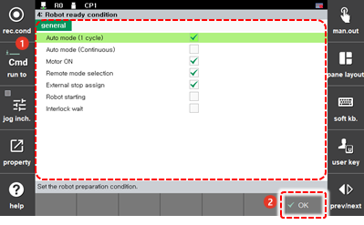

# 7.3.4 机器人准备状态

当机器人准备完成后，在`[机器人准备 OK]`项目中设置信号输出的条件，位于`系统 - 2: 控制参数 - 2: 输入/输出信号设置 - 4: 输出信号分配 (系统 - 2: 控制参数 - 2: 输入/输出信号设置 - 4: 输出信号分配)`菜单中。

1. 触摸`[2: 控制参数 - 4: 机器人准备状态] ([2: 控制参数 - 4: 机器人准备状态])`菜单。

2. 设置机器人准备状态后，触摸`[确定]`按钮。

    