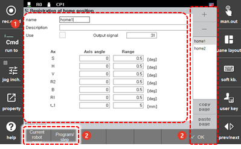

# 7.3.5 主位置注册

通过将机器人的任意姿态注册为主位置，您可以允许当机器人进入该位置时主位置信号输出到输出信号字段。主位置可以根据每个轴的姿态指定，最多可以注册和使用十六个姿态，并且每个轴的余量可以另外设置。

1. 触摸 `[2: 控制参数 - 5: 主位置注册] ([2: 控制参数  - 5: 主位置注册])` 菜单。

2. 选择主位置选项卡，然后设置使用、输出信号、轴角度和范围。

    

<table>
  <thead>
    <tr>
      <th style="text-align:left">编号</th>
      <th style="text-align:left">描述</th>
    </tr>
  </thead>
  <tbody>
    <tr>
      <td style="text-align:left">
        
      </td>
      <td style="text-align:left">
        
在选项卡中选择的主位置的详细信息。您可以
          设置使用、输出信号、轴角度和范围以及描述。

        <ul>
          <li>[使用]: 您可以设置是否使用。</li>
          <li>[输出信号]: 您可以输入输出信号编号。</li>
          <li>[轴角度]/[范围]: 您可以输入机器人在主位置的轴角度和范围。</li>
          <li>如果范围设置为0，则不会对该轴进行主位置检查。</li>
          <li>范围指的是覆盖主点的 + 方向和 - 方向的范围。例如，如果范围设置为0.5，则主位置信号的输出范围将为1。</li>
        </ul>
      </td>
    </tr>
    <tr>
      <td style="text-align:left">
        
      </td>
      <td style="text-align:left">
        <ul>
          <li>`[确定]`: 您可以保存更改。</li>
          <li><b>[当前机器人姿态]</b>: 当前机器人姿态的轴角度和范围将自动输入。</li>
          <li><b>[程序/步骤]</b>: 如果您输入程序和步骤编号，相关步骤的轴角度和范围将自动输入。</li>
        </ul>
      </td>
    </tr>
  </tbody>
</table>