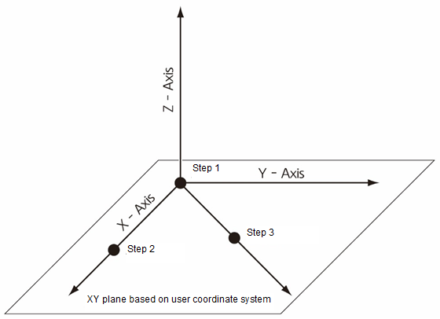
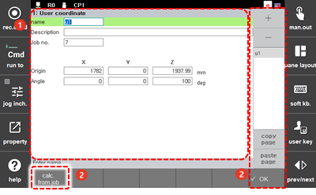

# 7.3.6.1 User Coordinate System

The user coordinate system is a coordinate system that is to be set at a position designated by the user. To use the user coordinate system, first, teach three reference steps that are needed to define the user coordinate system, and then register the user coordinate system by designating the taught program number and user coordinate system number.

Teach three reference steps by following the procedures below.

1.	Define the origin of the user coordinate system: Teach an arbitrary point.

2.	Define the X axis in the user coordinate system: Teach an arbitrary point on the X-axis line in a way that the arbitrary point can be 200 mm as distant as possible from the origin.

3.	Define the XY plane in the user coordinate system \(determine the Y-axis and Z-axis directions\): Teach an arbitrary point on the plane consisting of the X axis and Y axis at the point where the distance from the origin is 200 mm or more as possible.


* When the teaching of the user coordinate system setting program is performed, the TCP should be set to the correct values. Check whether the tool data of the currently selected tool is inputted correctly. 
* You can register up to 10 user coordinate systems.




The cautions in recording the reference points for defining the coordinate system are as follows.

* The reference 3 points should not exist on the same linear line.
* The distance between the reference 3 points should not be too close to each other.
* Subsequent steps after the XY plane in the user coordinate system is once defined will not have any effect on the coordinate system registration.


The method to register the user coordinate system by designating the taught program number and user coordinate system number is as follows.

1.	Touch the \[2: Control Parameter &gt; 6: Coordinate System Registration &gt; 1: User Coordinate System\] menu.

2.	Set the user coordinate system name and program number, and the distance and angle from each axis origin.

  

<table>
  <thead>
    <tr>
      <th style="text-align:left">No.</th>
      <th style="text-align:left">Description</th>
    </tr>
  </thead>
  <tbody>
    <tr>
      <td style="text-align_assets
        
      </td>
      <td style="text-align:left">Detailed information on the coordinate system selected from the user coordinate
        system list. You can set the coordinate system name and description, the
        taught program number, and the distance and angle from each axis origin.</td>
    </tr>
    <tr>
      <td style="text-align_assets
        
      </td>
      <td style="text-align:left">
        <ul>
          <li><b>[OK]</b>: You can save the changes.</li>
          <li><b>[+]/[-]</b>: You can add a new user coordinate system or delete a user
            coordinate system.</li>
          <li>A list of user coordinate systems. Selecting the coordinate system name
            allows you to check and edit details.</li>
          <li><b>[Copy Page]/[Paste Page]</b>: You can copy the user coordinate system
            information and paste it into another coordinate system.
             After selecting the name of the coordinate system information to be copied
            from the list, and then touching the <b>[Copy Page] </b>button, select the
            name of the coordinate system to which the value is to be applied, and
            then touch the <b>[Paste Page]</b> button.</li>
          <li><b>[Calc.from job]</b>: You can calculate the user coordinate system based
            on the taught program to define the user coordinate system.
             If you touch the <b>[Calc. from job]</b> button after inputting the taught
            program number in the<b> [Job no.]</b> option, the origin and angle of the
            user coordinate system will be calculated.</li>
        </ul>
      </td>
    </tr>
  </tbody>
</table>

