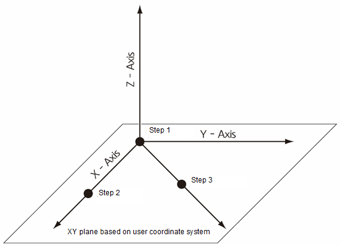
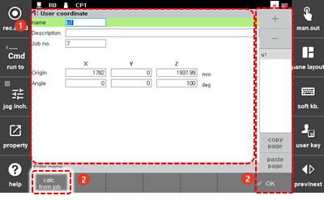

# 7.3.6.1 用户坐标系统

用户坐标系统是一个坐标系统，可在用户指定的位置进行设置。要使用用户坐标系统，首先需要教导定义用户坐标系统所需的三个参考步骤，然后通过指定教导的程序编号和步骤顺序来注册用户坐标系统。

按照以下步骤教导三个参考步骤。以下程序解释了步骤顺序指定为“OXY”时的情况（O：原点姿态，X：轴姿态，Y：平面姿态）。

1. 定义用户坐标系统的原点：教导一个任意点。

2. 定义用户坐标系统中的 X 轴：教导 X 轴线上的一个任意点，使得此点尽可能远离原点 200 mm。

3. 定义用户坐标系统中的 XY 平面 \(确定 Y 轴和 Z 轴方向\)：教导在 X 轴和 Y 轴组成的平面上一个任意点，此点离原点的距离尽可能 200 mm 或以上。


* 在进行用户坐标系统设置程序的教学时，TCP 应设置为正确值。检查当前选择工具的工具数据是否正确输入。
* 您可以注册最多 20 个用户坐标系统。



记录用于定义坐标系统的参考点时的注意事项如下。

* 参考 3 点不应位于同一条直线上。
* 参考 3 点之间的距离不应太近。
* S3 之后的后续步骤将不会对坐标系统注册产生影响。


通过指定教导的程序编号和步骤顺序注册用户坐标系统的方法如下。

1. 点击 `[2: 控制参数 - 6: 坐标系统注册 - 1: 用户坐标系统] ([2: 控制参数 - 6: 坐标系统注册 - 1: 用户坐标系统])` 菜单。

2. 转到您想注册的用户坐标系统（可以使用“+”按钮创建）。
3. 在指定程序编号和步骤顺序后，按下 [F1: JOB 计算] 按钮。
4. 计算得到的用户坐标系统原点的位置将会显示。

    

<table>
  <thead>
    <tr>
      <th style="text-align:left">编号</th>
      <th style="text-align:left">描述</th>
    </tr>
  </thead>
  <tbody>
    <tr>
      <td style="text-align:left">
        
      </td>
      <td style="text-align:left">从用户坐标系统列表中选择的坐标系统的详细信息。您可以设置坐标系统名称和描述、教导的程序编号、步骤顺序和基于基轴原点的原点姿态。</td>
    </tr>
    <tr>
      <td style="text-align:left">
        
      </td>
      <td style="text-align:left">
        <ul>
          <li>`[OK]`：您可以保存更改。</li>
          <li><b>[+]/[-]</b>：您可以添加新的用户坐标系统或删除用户坐标系统。</li>
          <li>用户坐标系统列表。选择坐标系统名称可以查看和编辑详细信息。</li>
          <li><b>[复制页面]/[粘贴页面]</b>：您可以复制用户坐标系统信息并粘贴到另一个坐标系统中。
             从列表中选择要复制的坐标系统信息名称，然后点击<b>[复制页面]</b>按钮，选择要将值应用到的坐标系统名称，再点击<b>[粘贴页面]</b>按钮。</li>
          <li><b>[从作业计算]</b>：您可以基于教导的程序和步骤顺序计算用户坐标系统以定义用户坐标系统。
             如果在<b>[作业编号]</b>选项和步骤顺序中输入教导的程序编号后点击<b>[从作业计算]</b>按钮，将计算出用户坐标系统的原点。</li>
        </ul>
      </td>
    </tr>
  </tbody>
</table>