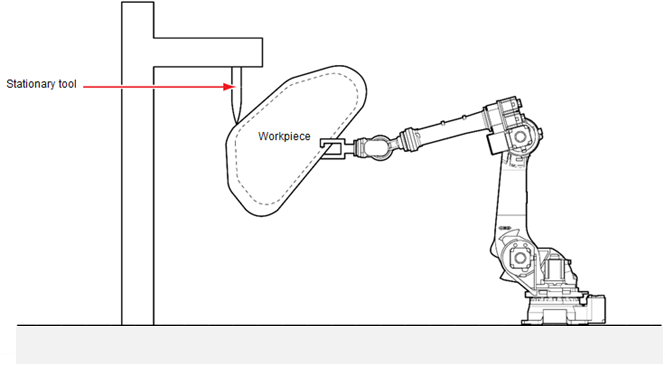
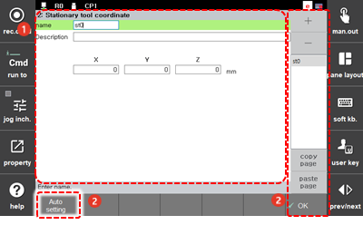
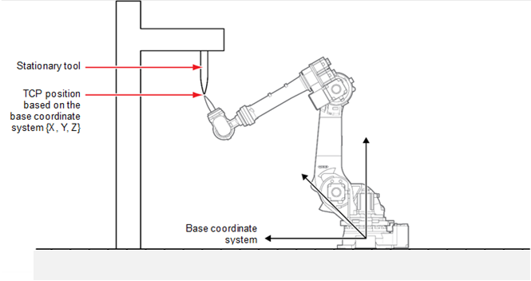
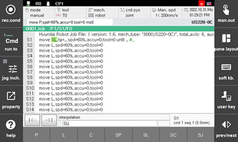

# 7.3.6.2 Stationary Tool Coordinate System

A robot tool is a tool attached to the front end of the robot. In general, robots perform operations using tools attached to the robot. A typical example is arc welding. The arc welding tool is usually attached to the front end of the robot and is used to perform welding on the externally fixed workpiece.

On the other hand, in the case of a stationary tool, the tool is attached to the outside, not the robot. In this case, the robot handles the workpiece and places it on an externally fixed tool to operate. A typical operation using a stationary tool is the sealing operation. Normally, in the sealing operation, when the external tool discharges a certain amount of solvent required for sealing, the robot holds the workpiece and creates the required trajectory to operate.

To create the required trajectory, the robot performs linear \(L\) and circular \(C\) interpolations based on the externally attached tool, not based on the tool attached to itself. At this time, the stationary tool interpolation function will be used.

When the stationary tool interpolation function is used, even if the posture of the workpiece held by the robot is changed, the moving path of the stationary tool on the workpiece can maintain the linear lines and arcs. As such, the stationary tool interpolation function must always be used for an operation for which the moving path of the external tool is important.

To use the stationary tool interpolation function, you must set the stationary tool coordinate system. 

The method to set the stationary tool coordinate system is as follows.

1.	Touch the \[2: Control Parameter &gt; 6: Coordinate Registration 2: Stationary Tool Coordinate System\] menu.

2.	Select the desired tab and register the position of the stationary tool coordinate system. 

    

<table>
  <thead>
    <tr>
      <th style="text-align:left">No.</th>
      <th style="text-align:left">Description</th>
    </tr>
  </thead>
  <tbody>
    <tr>
      <td style="text-align:left">
        
      </td>
      <td style="text-align:left">You can set a total of four stationary tool coordinate systems (tool 0
        - tool 3) by selecting a tab.</td>
    </tr>
    <tr>
      <td style="text-align:left">
        
      </td>
      <td style="text-align:left">
        <ul>
          <li>[OK]: You can save the changes.</li>
          <li>[Auto Setting]: You can set the current TCP position as the position of
            the stationary tool coordinate system.</li>
        </ul>
      </td>
    </tr>
  </tbody>
</table>

### Setting the Current TCP Position as the Position of the Stationary Tool Coordinate System

After accurately finding the TCP based on the robot base coordinate system, you should match the stationary tool and the robot tool, as shown in the figure below, and then execute the automatic setting function using the \[Auto Setting\] button. Then, the current TCP position will be registered.

### Writing a Program Using the Stationary Tool Coordinate System

To perform the recording for the stationary tool interpolation step, you should record the step as SL or SC. Using the \[Recording Condition\] button on the upper left of the Hi6 teach pendant screen, you can change the recording condition to SL \(stationary tool linear interpolation\) or SC \(stationary tool circular interpolation\).

For example, if you register and use the stationary tool coordinate system No. 1, you can create a program as follows.


In the case of using the stationary servo gun, the stationary tool interpolation function is not required. This is because, in the servo gun welding, the moving path of the workpiece for the stationary servo gun does not need to be formed in a linear line or arc while only the welding point is important.


