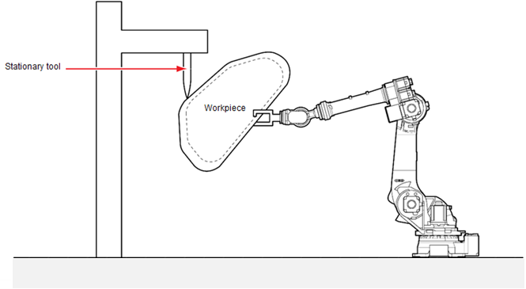
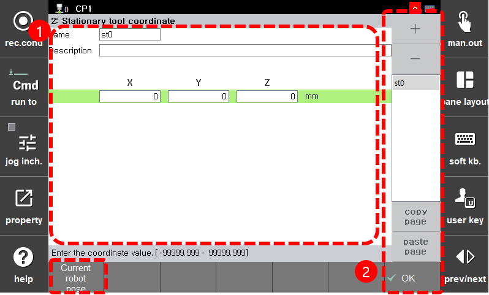
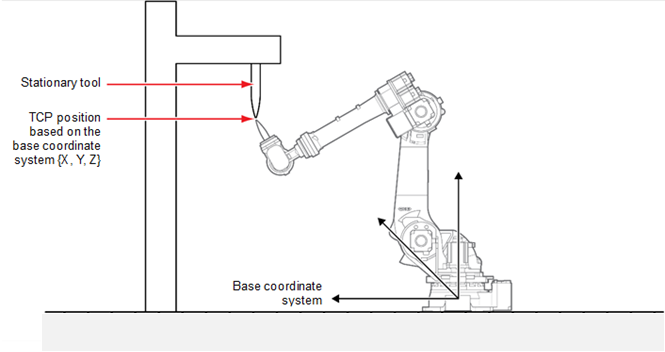
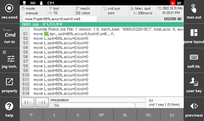

# 7.3.6.2 静态工具坐标系统

机器人工具是附加在机器人前端的工具。一般来说，机器人使用附加在机器人上的工具执行操作。一个典型的例子是弧焊。弧焊工具通常附加在机器人的前端，用于在外部固定的工件上进行焊接。

另一方面，在静态工具的情况下，工具附加在外部，而不是机器人上。在这种情况下，机器人处理工件并将其放置在外部固定的工具上以进行操作。使用静态工具的典型操作是密封操作。通常，在密封操作中，当外部工具释放出所需的某种量的溶剂以进行密封时，机器人持有工件并创建所需的轨迹进行操作。

为了创建所需的轨迹，机器人基于外部附加的工具执行线性 \(L\) 和圆形 \(C\) 插补，而不是基于附加在自己上的工具。在此期间，将使用静态工具插补功能。

当使用静态工具插补功能时，即使机器人持有的工件的姿态发生变化，静态工具在工件上的移动路径仍然可以保持直线和弧线。因此，静态工具插补功能必须始终用于外部工具的移动路径重要的操作。

要使用静态工具插补功能，必须设置静态工具坐标系统。

设置静态工具坐标系统的方法如下。

1. 触摸`[2: 控制参数 - 6: 坐标注册 2: 静态工具坐标系统] ([2: 控制参数 - 6: 坐标注册 2: 静态工具坐标系统])`菜单。

2. 选择所需的选项卡并注册静态工具坐标系统的位置。

    

<table>
  <thead>
    <tr>
      <th style="text-align:left">编号</th>
      <th style="text-align:left">描述</th>
    </tr>
  </thead>
  <tbody>
    <tr>
      <td style="text-align:left">
        
      </td>
      <td style="text-align:left">可以通过选择选项卡设置总共二十个静态工具坐标系统（工具0 - 工具19）。</td>
    </tr>
    <tr>
      <td style="text-align:left">
        
      </td>
      <td style="text-align:left">
        <ul>
          <li>[<b>确定</b>]: 可以保存更改。</li>
          <li>[<b>当前机器人姿态</b>]: 可以将当前TCP位置设置为静态工具坐标系统的位置。</li>
        </ul>
      </td>
    </tr>
  </tbody>
</table>

### 将当前TCP位置设置为静态工具坐标系统的位置

在准确找到基于机器人基坐标系统的TCP之后，应将静态工具与机器人工具匹配，如下图所示，然后使用`[当前机器人姿态]`按钮执行自动设置功能。然后，当前TCP位置将被注册。

### 使用静态工具坐标系统编写程序

要执行静态工具插补步骤的记录，您应该将步骤记录为SL或SC。在${cont_model}教学挂件屏幕左上角的`[录制条件]`按钮上，您可以将录制条件更改为SL \(静态工具线性插补\)或SC \(静态工具圆形插补\)。

例如，如果您注册并使用静态工具坐标系统编号1，则可以创建如下程序。


在使用静态伺服枪的情况下，静态工具插补功能不是必需的。这是因为在伺服枪焊接中，静态伺服枪的工件移动路径不需要以直线或弧线形成，而焊接点则是重要的。
