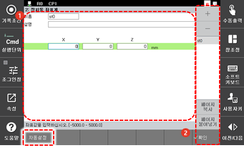
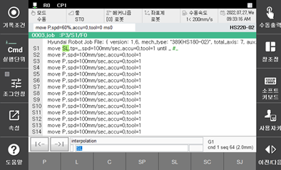

# 7.3.6.2 정치툴 좌표계

로봇 툴은 로봇 선단에 부착된 툴입니다. 일반적으로 로봇은 로봇에 부착된 툴을 이용하여 작업을 수행합니다. 대표적인 것으로 아크 용접이 있습니다. 아크 용접 툴은 통상적으로 로봇 선단에 부착되며 외부에 고정되어 있는 작업물에 용접을 수행할 때 사용합니다.

이에 반해서 정치툴\(Stationary Tool\)은 작업하는 툴이 로봇이 아닌 외부에 부착되어 있는 것으로, 이 경우에는 로봇이 작업물을 핸들링하여 외부에 고정된 툴에 위치시킴으로써 작업을 수행하게 됩니다. 정치툴을 이용한 대표적인 작업은 실링 작업입니다. 통상적으로 실링 작업은 외부에 부착된 툴이 실링에 필요한 용제를 일정한 양으로 토출하면 로봇이 작업물을 들고 실링에 필요한 궤적을 생성하여 작업합니다.

이 궤적을 생성하기 위해 로봇은 자체에 부착된 툴이 아닌 외부에 부착된 툴을 기준으로 직선 \(L\) 및 원호 \(C\) 보간을 수행합니다. 이때 정치툴 보간 기능을 사용합니다.

정치툴 보간 기능을 이용하면 로봇이 취부한 작업물의 자세가 변경되어도 정치툴의 작업물 상의 이동 경로는 직선 및 원호를 유지할 수 있습니다. 이와 같이 외부 툴의 이동 경로가 중요한 작업에는 반드시 정치툴 보간 기능을 이용합니다.

정치툴 보간 기능을 이용하려면 정치툴 좌표계를 반드시 설정해야 합니다.

정치툴 좌표계를 설정하는 방법은 다음과 같습니다.

1. \[2: 제어 파라미터 &gt; 6: 좌표계 등록 &gt; 2: 정치툴 좌표계\] 메뉴를 터치하십시오.
2. 원하는 탭을 선택하고 정치툴 좌표계의 위치를 등록하십시오.

<table>
  <thead>
    <tr>
      <th style="text-align:left">번호</th>
      <th style="text-align:left">설명</th>
    </tr>
  </thead>
  <tbody>
    <tr>
      <td style="text-align:left">
        
      </td>
      <td style="text-align:left">정치툴 좌표계는 탭을
        선택하여 총 4 개(tool 0 ~ tool 3)를
        설정할 수 있습니다.</td>
    </tr>
    <tr>
      <td style="text-align:left">
        
      </td>
      <td style="text-align:left">
        <ul>
          <li>[**확인**]: 변경 내용을 저장합니다.</li>
          <li>[자동설정]: 현재의 TCP 위치를
            정치툴 좌표계의 위치로
            설정합니다.</li>
        </ul>
      </td>
    </tr>
  </tbody>
</table>

* 현재 TCP 위치를 정치툴 좌표계 위치로 설정

로봇 베이스 좌표계를 기준으로 TCP를 정확히 찾은 후 그림과 같이 정치툴과 로봇툴을 일치시키고 \[자동설정\] 버튼으로 자동 설정 기능을 실행하십시오. 현재의 TCP 위치가 등록됩니다.

![그림 59 \[자동설정\] 버튼을 이용한 티칭 방법](../../../_assets/image_178.png)

* 정치툴 좌표계를 이용한 프로그램 작성

정치툴 보간 스텝으로 기록하려면 스텝을 SL 또는 SC로 기록합니다. Hi6 티치 펜던트 화면 좌측 상단의 \[**기록조건**\] 버튼을 이용하여 기록 조건을 SL \(정치툴 직선보간\) 또는 SC \(정치툴 원호보간\)로 변경하여 사용할 수 있습니다.

예를 들어, 정치툴 좌표계 0번을 등록하고 사용하는 경우에는 다음과 같이 프로그램을 작성할 수 있습니다.


정치 서보건 사용 시에는 정치툴 보간 기능이 필요하지 않습니다. 서보건 용접에서는 정치 서보건에 대한 작업물의 이동 경로가 직선 혹은 원호로 만들어질 필요가 없고 용접점만 중요하기 때문입니다.


