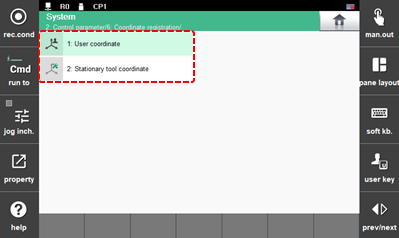

# 7.3.6 Coordinate System Registration

1.	Touch the \[2: Control Parameter &gt; 6: Coordinate Registration\] menu. Then, the coordinate system registration menu will appear. 

2.	By selecting the desired menu, you can set the coordinate system with respect to the user coordinate system or the stationary tool coordinate system.

    

