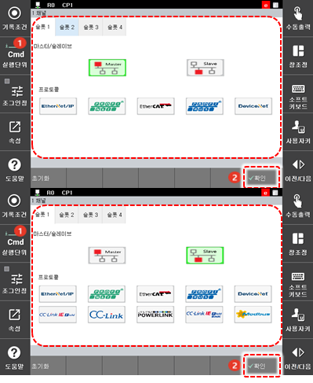

# 7.3.9.1 펌웨어 설정

산업용 통신에 사용할 펌웨어를 설정합니다.

1.	\[2: 제어 파라미터 &gt; 11: 산업용 통신 &gt; 1: 펌웨어 설정 &gt; 1 채널\] 메뉴를 터치하십시오. 펌웨어 설정 화면이 나타납니다.

2.	원하는 탭을 선택하고 통신 방식\(Master / Slave\)과 프로토콜을 설정한 후 \[**확인**\] 버튼을 터치하십시오. 펌웨어 설정이 완료됩니다.


펌웨어 설정 완료 시 슬롯 1 ~ 4에 설정된 CONGIF 파일이 모두 삭제됩니다. 사용 중 통신 펌웨어를 변경하려면 기존의 CONFIG 설정을 별도로 백업해 두고 필요한 경우 복원하여 사용하십시오.


3.	제어기의 전원을 끈 후 다시 켜십시오.


* 펌웨어의 사용 설정 시 제어기의 전원을 끈 후 다시 켜야만 설정값이 시스템에 적용됩니다.


